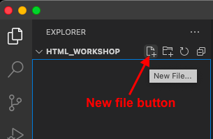
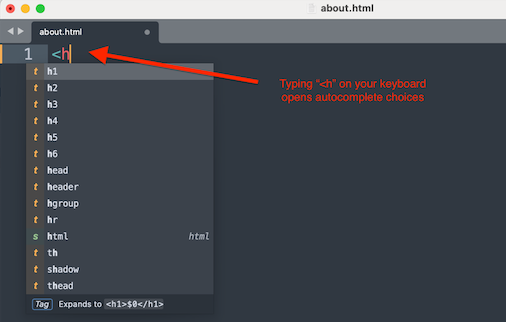
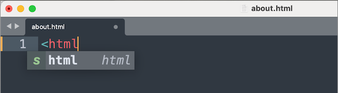
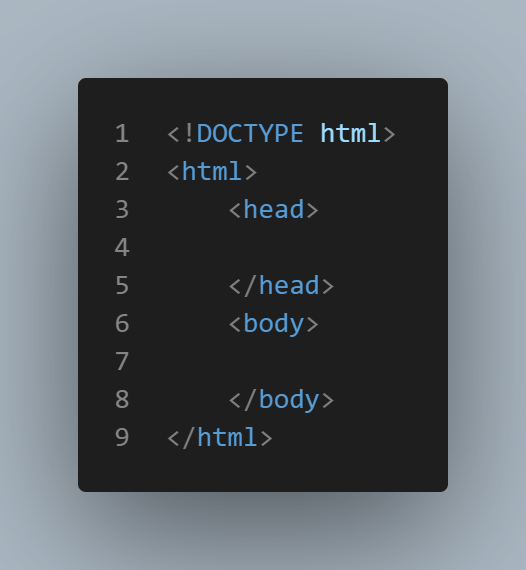
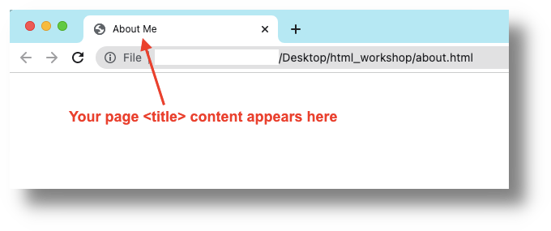
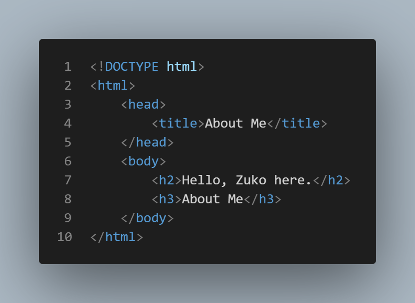
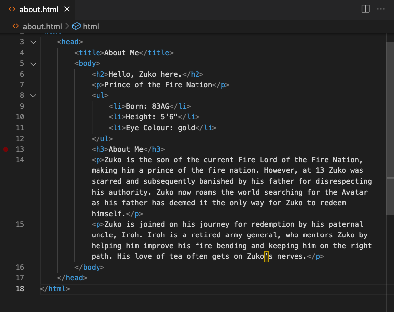
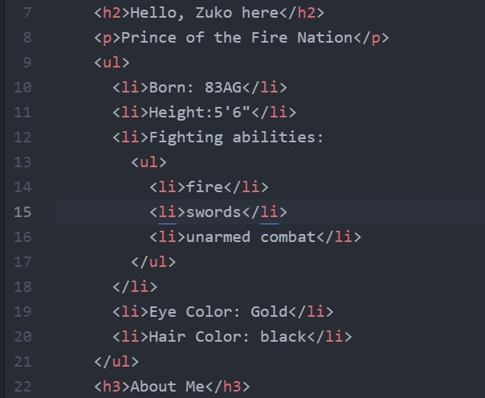

# Getting Started With HTML

Our HTML page will look basic at first, but if you finish the workshop you will have something that looks like a complete web page, with images, links, and more. 

If you have any questions, or get stuck, please ask the instructor for assistance. The intention of this workshop is for you to create an "about me" page, but it doesn’t have to be about you. For the workshop as a whole, you can use the examples provided, or apply their techniques and principles and create your own work as you like. My example "about me" page will be about "Zuko," a character from a cartoon show. Have fun!

If you haven’t already, **please install [Visual Code Studio text editor (↪)](https://code.visualstudio.com/) on your computer**. You are welcome to use any text editor you like, but our workshop examples use VCS. We use this editor because it has some smart features that help to prevent code errors.

## Create a directory and your first HTML file

- Open VCS.
- When you open VCS for the first time you will see a "Get Started" window, which you can close.
- We are going to create a new project in VCS by clicking in the main menu on **File** > **Open Folder**. A Dialogue box will appear. 
- Navigate to your **Desktop** and then click on the **New Folder** button.
- Name your folder, or directory, as follows: `html_workshop`. 
- Once back in VCS, you will see a navigation pane on the lefthand side of the VCS window. We will use this navigation pane to create our first file.
- To the right of your directory name (html_workshop), click on the "New file" button. 

- You will see a text field appear below the directory name. Now, we will add our file name. 
- Name your file exactly like this: `about.html`. 
- VCS will know that this new file is an HTML file because you used the `.html` extension, or suffix.
- We now have our first HTML file! VCS will now be able to provide some HTML features, such as autocompletes, suggestions, and colour themes to make your code easier to read.
    <!-- <button onclick="toggle('gif1')">Show/Hide Animation</button> -->
<!-- 

    
    
 -->
- To test VCS's autocomplete feature, type the letter “**h**”. VCS has a dropdown list of suggestions, and selecting one will autocomplete the line for you. Like autocomplete with texting, it is easy to make a mistake, so make sure you are selecting the right one. 

## Introducing HTML "tags"

- HTML uses tags to tell the browser how to interpret content (text, images, videos, and so on).
- HTML tags have three elements: 
    - (1) the opening tag, which has a descriptor symbol such as `h1` between two pointy, or angle, brackets: `<` and `>`; 
    - (2) the closing tag, which has the same symbols as the opening tag, with a forward slash _before_ the descriptor (there are some tags that don’t need a closing bracket and these are called "self-closing" tags); 
    - (3) finally, we have the content (everything between the opening bracket and the closing bracket).

## Essential HTML 

- The first thing we need to do is to add the following code at the very top left of our `about.html` page: `<!DOCTYPE html>`.

- The HTML `<!DOCTYPE html>` declaration is not an HTML element or tag, exactly, but an instruction that tells your browser what type of document to expect, so that your browser knows how to display, or render, it properly.
- Next, we need to tell the browser where our HTML code will go. 
- Press the enter key, to create a new line, and type the following tag: `<html>` (this is the "open" tag because there is no forward slash before `html`). 
- On another new line type the closing tag, as follows: `</html>` (this is the "closed" tag because there is a forward slash before `html`).
- When the browser opens this file it now knows how to deal with what is between these tags. There are many kinds of tags and you’ll be introduced to some of them.
- The next addition to our page will be within our tags. 
- Underneath the open `<html>` tag, type the following: `<head>`. 
- The `<head>` tag holds metadata (data about data) on our file, such as the page's title, but we’ll get to that later.
- Note that your text editor may automatically indent new tags by default. Indenting tags, especially within other tags, makes code more readable and orderly. 
- VCS might have already done this for you by default, but let's add our closing head tag, as follows: `</head>`. 
- Be sure to indent the closed `</head>` tag the same as the open <`head>` tag. 
- Make sure that both `<head></head>` tags are within the `<html>` tags. 
- Next, we want to create one set of open and closed `<body>` tags. The content within the <`body>` tags is where the main content of a website is held.
- Within the `<html>` tags, add an open `<body>` tag, hit return a couple of times, and add a closed `</body>` tag. You can also indent both of these tags. 
- Here is what your `about.html` page should look like so far: 
    
    

- Have you saved your file yet? Now is the time: in VCS's main menu, click on **File > Save As...** or hit **CTRL (or Command for Mac users) + S** on your keyboard.

<!-- <button onclick="toggle('gif2')">Show/Hide Animation</button> -->
<!-- 

    
    
 -->

### Title tags
    
- Our current _file_ name is `about.html`, but we want to add a different title to our page. On a website, this title will appear as the name of the page's tab. 
- The title tag goes within the `<head>` tag and is therefore part of our page's [metadata (↪)](https://en.wikipedia.org/wiki/Metadata). 
- Place your cursor underneath the _open_ `<head>` tag, then hit tab on your keyobard to create indent, then add the following: `<title></title>`. We will keep the title tag on one line, which makes it more legible than splitting it up.
- Between the (`<title></title>`) tags, type the following: `About Me`. 
- **Save your `about.html` file.**
- We will now look at our `about.html` in a browser. 
- Navigate to your **Desktop** and go into your `html_workshop` folder and click on the `about.html` file. Your `about.html` file will open in whatever browser is the default on your computer. In the following example, I have opened my `<about.html>` file in Chrome: 

    

Looking good! Let's move on to adding content to our `about.html` page...

### Headings tags
    
<!-- <button onclick="toggle('gif3')">Show/Hide Animation</button>-->
<!-- 

    
    
 -->
- Let’s move on to writing code and content between the `<body></body>` tags.
- We are going to start with heading or `<h>` tags.
- There are 6 types of heading tags: `h1`, `h2`, `h3`, `h4`, `h5`, and `h6`. Heading tags range from biggest text size, with `h1`, to the smallest text size, with `h6`.
- Heading tags are written as follows: 
`<h1></h1>`
- We are going to add the following heading tags (between the `<body></body>` tags) and content to our page:
`<h2>Hello, Zuko here.</h2>` 
`<h3>About Me</h3>`
- Here is an example of what we have, so far: 

- As you did before, **Save** your file and open it in your browser. Be sure to [hard refresh (↪)](https://www.howtogeek.com/672607/how-to-hard-refresh-your-web-browser-to-bypass-your-cache/) your browser if you do not see the changes you expect. 
- Feel free to take some time to try different heading tags to see the differences between them.

### Paragraph tag

- The `p` tag is used for paragraphs. 
- The content you want in a paragraph would go between the open and closed paragraph tags, as in the following example: 
    `
Your paragraph content would go here.
`
- We are going to add a couple of `p` tags and some content within them: 
        `<h2>Hello, Zuko here.</h2>` 
        `
Prince of the Fire Nation
` 
        `<h3>About Me</h3>` 
        `
Zuko is the son of the current Fire Lord of the Fire Nation, making him a prince of the fire nation. However, at 13 Zuko was scarred and subsequently banished by his father for disrespecting his authority. Zuko now roams the world searching for the Avatar as his father has deemed it the only way for Zuko to redeem himself.
` 
- <mark>Note</mark>: the paragraph content about Zuko is longer than anything we have added so far, and it could be that our paragraph text exceeds the width of the VCS window, depending on how wide you have made it on your computer. If your text is disappearing off to the right of the VCS window, and you have to scroll right to see it, we can enable "Word Wrap" so that you can always see your text no matter what size you make your VCS window. 
  - To enable word wrap in VCS, click on **View > Word Wrap**. 
- Let's add another paragraph beneath the first paragraph: 
`
Zuko is joined on his journey for redemption by his paternal uncle, Iroh. Iroh is a retired army general, who mentors Zuko by helping him improve his fire bending and keeping him on the right path. His love of tea often gets on Zuko’s nerves.
`
- As you did before, **Save** your file and open it in your browser. 
<!-- <button onclick="toggle('gif4')">Show/Hide Animation</button>-->
<!-- 

    
    
 -->
- Our page is coming along nicely! Let's add another bit of common website content: a list. 
    
### List tags
    
- You can use HTML markup to create two kinds of lists: ordered lists and unordered lists. 
- Use an ordered list if you want to display content in a particular order. 
- Use an unordered list if the order of the list items does not matter. 
- Ordered lists use an `<ol>` tag and display, in browsers, as numbered lists, meaning that a number will appear beside your list item. Here’s an example of an ordered list:  
> Frodo’s top three traveling essentials, in order of importance: 
> 1. The One Ring
> 2. Sting (the sword, not the musician)
> 3. Samwise Gamgee
- Unordered lists use a `<ul>` tag and display, in browsers, as a bulleted lists. Here’s an example of an unordered list: 
> Frodo’s shopping list for Bree Market: 
> - Pipe weed
> - Craft beer
> - Even more lembas bread?
- Both ordered (`<ol>`) and unordered (`<ul>`) lists contain list items, which are indicated with an `<li>`, or list item, tag. 
- It is considered best markup practice to indent your `<li>` tags within the `<ol>` or `<ul>` tags. 
- In the following examples, I use unordered lists, since the list (`<li>`) items do not need to be in any particular order. Note that the lists in both examples are nested inside paragraph (`
`) tags. 
- I have added a list of some of Zuko's attributes on my `about.html` page. I used an unordered list, since these details are not in any particular order.
- Here is an example of what we have, so far:

<!-- <button onclick="toggle('gif5')">Show/Hide Animation</button> -->
    
<!-- 

    
    
 -->

<!--  -->

### Text tags
    
- Applying style (such as font colours and sizes) to your HTML code should be done in CSS files (which we look at soon), but making changes in the HTML file is sometimes appropriate. For example, the `<del></del>` and `<ins></ins>` tags are used to indicate certain types of text. The `<del>` tag puts a line through the text and the `<ins>` tag underlines text.
- HTML tags can be put around any text. These tags don't have to encompass a whole block of text, or even a whole word, as in the following example:
    - This is <strong>important</strong>. This is <strong><ins>very</ins> important.</strong> Thank <ins>you!</ins>
    - We have two words in bold, one word underlined, and one word underlined _and_ in bold. Let’s look at what that would look like in HTML, with tags: `
This is <strong>important</strong>. This is <strong><ins>very</ins>important.</strong> Thank <ins>you!</ins>
`
- Notice where the spaces and full stops are. With so many tags, it can be easy to forget to add important content in the right places.
- On your `about.html` page, play around with some of the following tags, saving your file as you go(!) and then looking at it in your browser:
  - `<strong>` = important
  - `<i>` = italic
  - `<em>` = emphasized
  - `<mark>` = marked, or <mark>highlighted</mark>
  - `<small>` = smaller
  - `` = subscript
  - `` = superscript
- Remember that there is no right or wrong with our growing `about.html` page. 
- We are taking this time to play around. Often, the best learning happens when we break things! 
- Let's move on the next section in our workshop....

[NEXT STEP: Adding Images and Links in HTML](act-2.html){: .btn .btn-blue }
