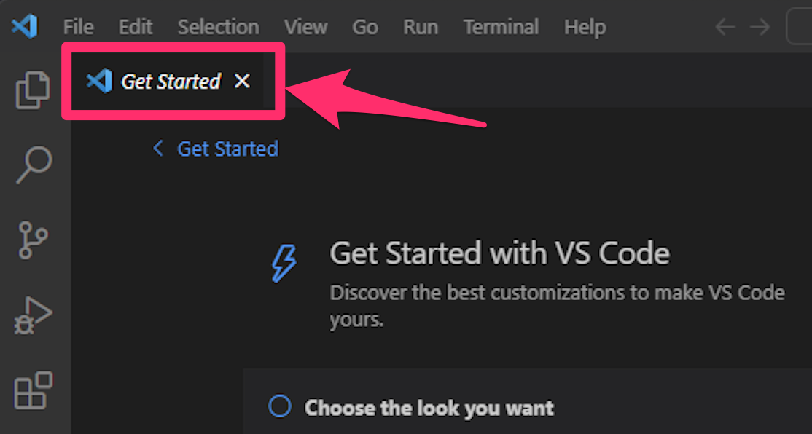
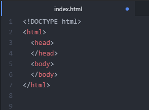
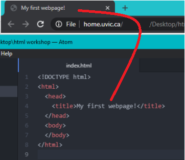

# Getting Started With HTML

To start, we will be learning about adding basic components to an about me page like text. If you and your group have any questions, or get stuck as you work through this in-class exercise, please ask the instructor for assistance.  Have fun!

1.  If you haven’t already, please install [Vistual Studio Code editor](https://code.visualstudio.com/download){:target="_blank"} on your computer. You are welcome to use any text editor you like, but our examples use the Visual Studio Code Editor.
2. This exercise will be for creating an about me page, it doesn’t have to be about yourself. Mine will be about Zuko, a character from a cartoon show.
4.  **Coding Time:**
    -   Start the process of creating a new project by clicking on the **File** menu and then **Open Folder**. A Dialog box will appear. 
    -   Navigate to either your **Desktop** or **Documents** folder, and then click on the **Create Directory** button.
    -   Name your directory "**html_workshop**" You can always move it for future use.
    -   You’ll notice on the left hand side the “html_workshop” folder. We now need to create our first file.
        -   Under **File**, click  **New Text File**.
        -   Click on the blue **Select a language** link and then scroll down and select **HTML** (you can also typle "html" in to the search box and then select it).
        -   Again, under **File** click on **Save As..** and save the file as “**about.html**”.
        -   We now have our first HTML file. Atom recognizes this and will help you with your code with helpful autocompletes, suggestions, and colouring.
    
    <button onclick="toggle('gif1')">Show/Hide Animation</button>
    

    
    

        

    
    
   -   To see an example of how Atom can help us out, type the letter “**h**”. Atom has a dropdown list of suggested items, selecting one of these will autocomplete the line for you. Like autocomplete with texting, it is easy to make a mistake. So make sure you are selecting the right one.
    -   Now it’s time to get to the actual coding portion.
    -   Typing “**html**” will give you an option to autocomplete. Feel free to click enter to see what it looks like, but we will start from a blank page.
    -   HTML uses tags to tell the browser how to interpret text. Tags are built with three components: (1) the opening tag, which has a descriptor symbol such as “h1” between two pointy brackets: < and >; (2) the closing bracket, which has the same symbols as the opening bracket, with a forward slash before the descriptor (there are some tags that don’t need a closing bracket. They are called self-closing tags); (3) finally, the content (everything between the opening bracket and the closing bracket).
    -   The first thing needed is an HTML declaration: **<!DOCTYPE html>**
    -   This is not an HTML tag, but is a declaration for the browser. When a browser opens this file it reads this line and understands that this is an HTML document. 
    -   Next we need to tell the browser where our HTML code will go. On a new line (press the enter key) and type **<html>**. Go down to a new line and type **</html>** as this is the closing html tag. The browser interprets this code as HTML from the opening tag to the closing HTML tag. 
**&lt;html&gt;** **&lt;/html&gt;**
-   When the browser opens this file it now knows how to deal with what is between these tags as it’s a recognized tag. There are many kinds of tags and you’ll be introduced to some of them.
    -   The next part will be within our tags. Underneath the opening tag click the tab key once. Then type <head>. Atom automatically indents tags by default. Indenting tags, especially within other tags, makes our code more readable and orderly. Similarly, we want to have our closing head tag (</head>) indented the same amount, still in between the HTML tags. The head tag holds metadata (data about data) on our file, things like styling and  title, but we’ll get to that later.
    -   Next, we want to create the body tags. This is where the content of the website is held. Underneath the closing head tag, but still within the HTML tags, <body> and </body> should both be indented once, similar to head.
    
    
    
    -   It’s good to note that HTML is not case sensitive. You could write the body tag as **<BODY>** or even **<BoDy>** and it would work. However, it’s best practice to keep to the same pattern, so if you choose to capitalize, capitalize uniformly.
    -   Although our page is empty we can still open it in our browser. First thing we need to do is save the changes we’ve made. Under “**File**”, click “**Save**”. Now open the file by double clicking “**about.html**” in your “**html_workshop**” folder. This should open a browser with nothing on the page.

    <button onclick="toggle('gif2')">Show/Hide Animation</button>
    

    
    

    

5.  **Title Tag**
    -   The title tag goes within the head tag and is the title of our webpage. You may notice our current title is “about.html”, but we want to change this. Since it is within the head tags we indent one space and add **&lt;title&gt;&lt;/title&gt;** and then add your own text between these two tags.
    -   This will always be one line, so leaving the closing tag on the same line will make it more legible than splitting it up. Between the title tags, type “About Me”. Save your file and refresh your browser.

    

6.  **H and P Tags**
    
    <button onclick="toggle('gif3')">Show/Hide Animation</button>
    

    
    

   
    
  -   Let’s move onto the body part of our code. “h” tags are HTML heading tags. There are 6 types: “h1”, “h2, “h3”, “h4”, “h5”, and “h6”. Inherently, h1 gives the largest text and h6 the smallest. The tags are written like so: 
**&lt;h1&gt;&lt;/h1&gt;**
  -   Put text within the above header tags to make a header.
  -   Like the title tags they can go on the same line. Don’t forget to indent from the body. I'm going to write two tags, h2 and h3: 
**&lt;h2&gt;**Hello, Zuko here.**&lt;/h2&gt;** 
**&lt;h3&gt;**About Me**&lt;/h3&gt;**
-   See the changes you’ve made by saving and refreshing your webpage. Feel free to try different heading tags to see the difference between them and find what works best for you.
-   The “p” tag is used for paragraphs of text and are written as: 
**&lt;p&gt;&lt;/p&gt;**
 -   Underneath each h tag, add a paragraph tag. If you are following along you can add the following in the p tags, if not add what is appropriate to your page: 
        `<h2>Hello, Zuko here.</h2>` 
        `
Prince of the Fire Nation
` 
        `<h3>About Me</h3>` 
        `
Zuko is the son of the current Fire Lord of the Fire Nation, making him a prince of the fire nation. However, at 13 Zuko was scarred and subsequently banished by his father for disrespecting his authority. Zuko now roams the world searching for the Avatar as his father has deemed it the only way for Zuko to redeem himself.
` 
    -   Atom has a helpful feature to make your file more readable. If your text exceeds the width of Atom you can compress it instead of having to scroll sideways. Under **View** click **Toggle Soft Wrap**.
    -   I’m going to add another paragraph beneath the last p tag. This will still be in the about me section. Separating items in different tags can be helpful when you want them to appear or behave in different ways when it comes to changing layout. For the Zuko page I’m adding the following: 
        `
Zuko is joined on his journey for redemption by his paternal uncle, Iroh. Iroh is a retired army general, who mentors Zuko by helping him improve his fire bending and keeping him on the right path. His love of tea often gets on Zuko’s nerves.
`

<button onclick="toggle('gif4')">Show/Hide Animation</button>
    

    
    

    

7.  **List Tags**
    -   HTML has tags that can create lists for us. Ordered lists, “<ol>”, make each item organized by a number and unordered lists, “<ul>”, make bullet-point styled lists. The way to add to a list is with a list tag: 
**&lt;li&gt;&lt;/li&gt;**
    -   “<li>” or list tags are written within “<ol>” or “<ul>” tags and its best practice to have them indented. I want to add a list of attributes on my about page. I’ll make a list underneath the paragraph tags with “Prince of the Fire Nation”. I used an unordered list since these details are not in any particular order.

<button onclick="toggle('gif5')">Show/Hide Animation</button>
    

    
    

    

8.  **Text Tags**
    -   Styling should be done in CSS files but sometimes making changes in the HTML file can be helpful. For example, the **&lt;del&gt;&lt;/del&gt;** and **&lt;ins&gt;&lt;/ins&gt;** tags can be helpful to highlight specific text. The **&lt;del&gt;** tag puts a line through the text and the **&lt;ins&gt;** tag underlines text.
    -   HTML tags can be put around any text that shows up in the browser. These tags don't have to encompass the whole text, it doesn't even have to cover a whole word. Say I wanted the following text to be typed out in a paragraph:
    -   This is <strong>important</strong>. This is <strong><ins>very</ins> important.</strong> Thank <ins>you!</ins>
        -   We have 2 words in bold, 1 word underlined, and 1 word underlined & in bold. Let’s look at what that would look like with tags.
        -   **&lt;p&gt;**This is **&lt;strong&gt;**important**&lt;/strong&gt;**. This is **&lt;strong&gt;&lt;ins&gt;**very**&lt;/ins&gt;** important.**&lt;/strong&gt;** Thank **&lt;ins&gt;**you!**&lt;/ins&gt;&lt;/p&gt;**
        -   Notice where the spaces and full stops are. With so many tags, it can be easy to forget to add important content in the right places.
    -   Try some more types of text altering tags.
        -   **&lt;strong&gt;** - Important text
        -   **&lt;i&gt;** - Italic text
        -   **&lt;em&gt;** - Emphasized text
        -   **&lt;mark&gt;** - Marked text
        -   **&lt;small&gt;** - Smaller text
        -   **&lt;sub&gt;** - Subscript text
        -   **&lt;sup&gt;** - Superscript text

[NEXT STEP: Adding Images and Links in HTML](act-2.html){: .btn .btn-blue }
