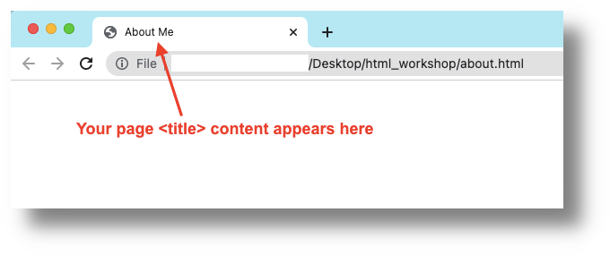
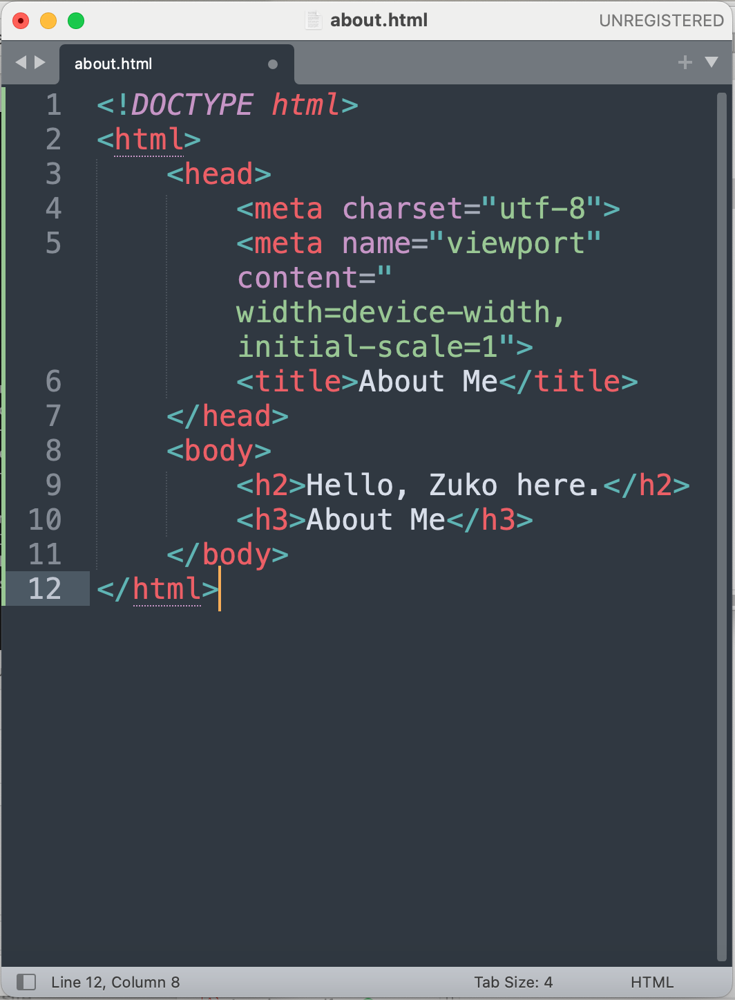
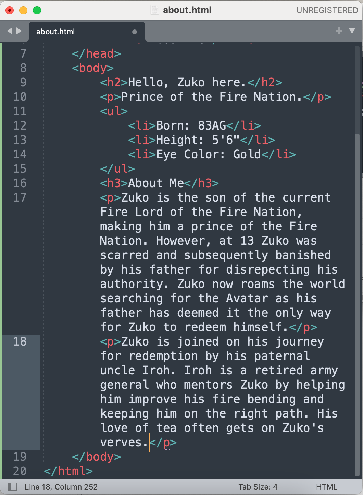
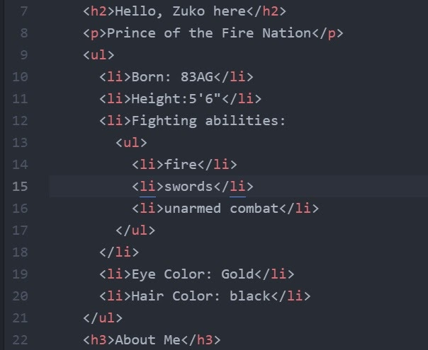

# Getting started with HTML

Our HTML page will look basic at first, but if you finish the workshop you will have something that looks like a complete web page, with images, links, and more. 

If you have any questions, or get stuck, please ask the instructor for assistance. 

The intention of this workshop is for you to create an "about me" page, but it doesn’t have to be about you. For the workshop as a whole, you can use the examples provided, or apply their techniques and principles and create your own work as you like. My example "about me" page will be about "Zuko," a character from a cartoon show. Have fun <span style='font-size:20px;'>&#128512;</span>

If you haven’t already, **please install [Sublime text editor](https://www.sublimetext.com/download) on your computer**. You are welcome to use any text editor you like, later, but our workshop examples use Sublime Text. We use this editor because it has some smart features that help to prevent errors and typos.


## Create a directory (folder)

- First, we are going to **create a new folder** (AKA a "directory"):
	-  **Windows users:** open **[File Explorer](https://support.microsoft.com/en-us/windows/file-explorer-in-windows-ef370130-1cca-9dc5-e0df-2f7416fe1cb1)** and select **Desktop**. Next, right click somewhere on the empty space in the Explorer window and select **New** > **New Folder** 
	- **Mac users:** right click (or Control + click) somewhere on the empty space on your desktop and select **New Folder**
- Name your folder as follows: `html_workshop`.

    <button onclick="toggle('gif1')">Show/Hide Animation</button>
    <div id="gif1">
     <br>
    </div> 

## Create an HTML document
This section will walk you through now to create, name, and save your first HTML file, or document, using Sublime Text. 

1. Open **Sublime Text**.
2. In the top left of the main menu, select **File** > **New File**. You should see an empty file with the title of "untitled." Next, we need to name and save our file.
3. In the main menu, select **File** > **Save as**, then navigate to the `html_workshop` folder we created earlier. Now, **name the file** exactly like this: **`about.html`**.
4. Finally, **click the Save button**. Sublime Text will now recognize your file as an HTML file because you used the `.html` extension, or suffix.

## Introducing HTML "tags"

HTML (Hypertext Markup Language) is a "markup" language, or a text-encoding system that defines the structure and formatting of a digitial "document," such as a web page. So, when we talk about "code" in this context, we are referring to "encoding." 

Like any language, HTML is an agreed-upon set of codes that define shared meanings. Another word for the act of encoding is "tagging." We use HTML "tags" to tell a web browser—such as Firefox, Safari, or Chrome—how to interpret and categorize specific content (text, images, videos, and so on). 

For example, we might want some part of our text, like a chapter title, to be a heading. A heading will stand out from the rest of the text by being larger and bolder than the text around it. In that case, we would use the HTML tag for a heading, and "wrap" a selection of text with that tag. The combination of a tag and the content within it is called an HTML element. 

Next, let's look at the anatomy of a tag.

**HTML tags have three elements:**
1. the **"opening" tag**, which has a descriptor symbol such as `h1` between two pointy, or angle, brackets: `<` and `>`; 
2. the **"closing" tag**, which has the same symbols as the opening tag, with a forward slash _before_ the descriptor—there are some tags that don’t need a closing bracket and these are called "self-closing" tags, but will ignore those for now; 
3. the **"content"**, which is everything between the opening tag and the closing tag. Browsers are designed to hide tags, but display the content between them. 


> **<mark>Note</mark>** that Sublime Text is programmed to provide some HTML features, such as autocompletes, suggestions, and other features to make your "[markup](https://en.wikipedia.org/wiki/Markup_language)" work easier and more reliable. For example, try Sublime Text's autocomplete feature by typing the letter “**<h**”. Note that a dropdown list of suggestions will appear, giving you the option to autocomplete the line for you.
>
> Like autocomplete with texting, it is easy to make a mistake, so always make sure that you are selecting the correct choice.
> 
>

## Essential parts of a complete HTML document

When we talk about a "complete" or "compliant" HTML file, we are referring to what basic parts of an HTML file we need to have it pass modern and ever-changing [web standards](https://en.wikipedia.org/wiki/Web_standards) for web browsers. Having a web-compliant HTML file, or website, is important for a number of reasons. 

We want our site to load and look as expected. More important is that the Internet is intended, as explained on the [World Wide Web Consortium (W3C)'s website](https://www.w3.org/WAI/fundamentals/accessibility-intro/), "to work for all people, whatever their hardware, software, language, location, or ability. When the Web meets this goal, it is accessible to people with a diverse range of hearing, movement, sight, and cognitive ability." 

### DOCTYPE declaration

Browsers can open and display more than HTML files, so we need to "declare" what kind of file we have to the browser. 

Although not technically a tag (it is a "keyword"), a DOCTYPE declaration, or DTD, tells the browser what document type to expect. 

> **<mark>Note</mark>** that some tags are [case senstive](https://en.wikipedia.org/wiki/Case_sensitivity), and some are not. In this case, "DOCTYPE" must be in all-caps.
<br>

1. In your `about.html` file, add the following at the top-left of the file: `<!DOCTYPE html>`
2. Save your file. 

### Adding your first HTML tag: the <html> tag

Now, we need to add the HTML tag. If you think of HTML tags as nesting dolls, this tag is the largest doll, with all other subsequent dolls/tags contained within it. 

1. In your `about.html` file, add the following underneath `<!DOCTYPE html>`: `<html></html>`
2. Save your file. 

By now, your `about.html` file should look like this: 

```
<!DOCTYPE html>
<html></html>
```
### The head tag: <head>

Head tags appear, as the name suggests, at the head of the document. The content within head tags tells important information to the browser. The head tag also contains an essential element of any HTML page: the page "title." 

Page titles typically appear in browser tabs, otherwise, the browser tab for your page would be blank. 

The head tag also contains essential "metadata," or data about data. Metadata in this case is data about the HTML document. With the exception of the `<title>` tag, elements within the `<head>` are _not_ displayed by your browser.

1. In your `about.html` file, place your cursor between the `<html></html>` tags and hit return at least three times. We are making some space for our new tags. Your `about.html` file should now look something like this:

```
<!DOCTYPE html>
<html>

	
</html>
```
2. Directly underneath the opening `<html>` tag, add the follwing opening and closing `<head>` tags:
`<head></head>`
3. As you did for the `<html>` tags, make some space between the `<head>` tags. Then, add the following "meta" tag: <meta charset="UTF-8">

> **<mark>Note</mark>** that the **"charset"** (charachter set) attribute specifies the [character encoding](https://www.w3.org/International/articles/definitions-characters/) for the HTML document. By telling the browser to use "UTF-8" (**Unicode** Transformation Format–8 bit), rather than letting the browser guess, your web page will now be able to display nearly every character and symbol it is possible to display in a browser. Currently, "[Unicode](https://en.wikipedia.org/wiki/Unicode)" has nearly 160,000 characters and over 170 scripts, including emojis, symbols, ancient languages, and more.  

4. Save your file.
5. We are now going to add a title to our web page. Underneath the `<meta>` tag, add the following tags: `<title></title>`.
6. Save your file. 

Your `about.html` file should look like this: 
```
<!DOCTYPE html>
<html>
<head>
<meta charset="utf-8">
<title></title>
</head>
</html>
```
7. Between your `<title>` tags, add whatever text you like. Whatever you add between the `<title>` tags will appear in the tab of your web page. In my example, I am writing a short biography of [Frodo Baggins](https://en.wikipedia.org/wiki/Frodo_Baggins), so here is what my `about.html` page looks like at this stage:

```
<!DOCTYPE html>
<html>
<head>
<meta charset="utf-8">
<title>Frodo Baggins bio</title>
</head>
</html>
```
> **<mark>Note</mark>** that I kept my title short. Browser tabs are only so wide, and I want my readers to be able to see the whole title.

8. Save your file.

### Seeing your (blank) page for the first time
Now it is time to see what your `about.html` file looks like to a browser! 

1. Navigate to where you saved your `about.html` file.
2. Right click (or Control + click if you are on a Mac), and open with the browser of your choosing. In my case, this is what my file looks like in the Firefox browser:


Right now, all we should see is a blank page and the page's title in the browser tab. Now it is time to add some content to our page....

## Essential content of a basic HTML document 
Up to this point, we have learned what it takes to create to create a barebones HTML file, that is, the bare minumum elements to have a browser recognize our `about.html` file as a web page. 

Next, we will add what web developers consider the basic elements of web page, and then we will add some content to display. 

### The body tag: <body>
The `<body>` tag is appropriately named becasue that is where the body of your content—such as paragraphs, images, links, lists, and more—will be displayed on your web page. There can be only one set of `<body></body>` tags within an HTML file. 

1. Go back to Sublime Text and return to your `about.html` file.
2. Below the closing `</head>` tag (and above the closing `</html>` tag) add the following tags: `<body></body>`

Your file should now look something like this: 

```
<!DOCTYPE html>
<html>
<head>
<meta charset="utf-8">
<title>Frodo Baggins bio</title>
</head>
<body></body>
</html>
```
Now, **let's do a little visual housekeeping**, as it can be easier to keep track of things when we separate out some of the elements from each other.

Here's what my file now looks like, for easier reading: 

```
<!DOCTYPE html>
<html>

<head>
<meta charset="utf-8">
<title>Frodo Baggins bio</title>
</head>

<body>
</body>

</html>
```

### The paragraph tag: <p>
Paragraph tags `<p></p>` tell that browser to treat the text between them as separate blocks of text, or paragraphs. All browsers by default will a line break, or place a single blank line, before and after each set of `<p></p>` tags. Paragraph tags always appear, or are "nested," between the `<body></body>` tags. 

1. In your `about.html` file, make some space between the `<body></body>` tags and add two sets of paragraph tags, and add some space between them:
```
<body>

<p></p>

<p></p>

</body>
```
2. Save your file.

_Before_ we add any content between the paragraph tags, we are going to add one last element seen in nearly all web pages, and that is a heading of some kind. 


<!-- <button onclick="toggle('gif2')">Show/Hide Animation</button> -->
<!-- <div id="gif2">
    
    </div> -->


    

Looking good! Let's move on to adding content to our `about.html` page...

### Headings tags
    
<!-- <button onclick="toggle('gif3')">Show/Hide Animation</button>-->
<!-- <div id="gif3">
    
    </div> -->
- Let’s move on to writing code and content between the `<body></body>` tags.
- We are going to start with heading or `<h>` tags.
- There are 6 types of heading tags: `h1`, `h2`, `h3`, `h4`, `h5`, and `h6`. Heading tags range from biggest text size, with `h1`, to the smallest text size, with `h6`.
- Heading tags are written as follows:<br>
`<h1></h1>`
- We are going to add the following heading tags (between the `<body></body>` tags) and content to our page:
`<h2>Hello, Zuko here.</h2>`<br>
`<h3>About Me</h3>`
- Here is an example of what we have, so far: 



- As you did before, **Save** your file and open it in your browser. Be sure to [hard refresh (↪)](https://www.howtogeek.com/672607/how-to-hard-refresh-your-web-browser-to-bypass-your-cache/) your browser if you do not see the changes you expect. 
- Feel free to take some time to try different heading tags to see the differences between them.

### Paragraph tag

- The `p` tag is used for paragraphs. 
- The content you want in a paragraph would go between the open and closed paragraph tags, as in the following example:<br>
    `<p>Your paragraph content would go here.</p>`
- We are going to add a couple of `p` tags and some content within them:<br>
        `<h2>Hello, Zuko here.</h2>`<br>
        `<p>Prince of the Fire Nation</p>`<br>
        `<h3>About Me</h3>`<br>
        `<p>Zuko is the son of the current Fire Lord of the Fire Nation, making him a prince of the fire nation. However, at 13 Zuko was scarred and subsequently banished by his father for disrespecting his authority. Zuko now roams the world searching for the Avatar as his father has deemed it the only way for Zuko to redeem himself.</p>`<br>
- <mark>Note</mark>: the paragraph content about Zuko is longer than anything we have added so far, and it could be that our paragraph text exceeds the width of the Sublime window, depending on how wide you have made it on your computer. If your text is disappearing off to the right of the Sublime window, and you have to scroll right to see it, we can enable "Word Wrap" so that you can always see your text no matter what size you make your Sublime window. 
  - To enable word wrap in Sublime, click on **View > Word Wrap**. 
- Let's add another paragraph beneath the first paragraph:<br>
`<p>Zuko is joined on his journey for redemption by his paternal uncle, Iroh. Iroh is a retired army general, who mentors Zuko by helping him improve his fire bending and keeping him on the right path. His love of tea often gets on Zuko’s nerves.</p>`
- As you did before, **Save** your file and open it in your browser. 
<!-- <button onclick="toggle('gif4')">Show/Hide Animation</button>-->
<!-- <div id="gif4">
    
    </div> -->
- Our page is coming along nicely! Let's add another bit of common website content: a list. 
    
### List tags
    
- You can use HTML markup to create two kinds of lists: ordered lists and unordered lists. 
- Use an ordered list if you want to display content in a particular order. 
- Use an unordered list if the order of the list items does not matter. 
- Ordered lists use an `<ol>` tag and display, in browsers, as numbered lists, meaning that a number will appear beside your list item. Here’s an example of an ordered list:  
> Frodo’s top three traveling essentials, in order of importance: 
> 1. The One Ring
> 2. Sting (the sword, not the musician)
> 3. Samwise Gamgee
- Unordered lists use a `<ul>` tag and display, in browsers, as a bulleted lists. Here’s an example of an unordered list: 
> Frodo’s shopping list for Bree Market: 
> - Pipe weed
> - Craft beer
> - Even more lembas bread?
- Both ordered (`<ol>`) and unordered (`<ul>`) lists contain list items, which are indicated with an `<li>`, or list item, tag. 
- It is considered best markup practice to indent your `<li>` tags within the `<ol>` or `<ul>` tags. 
- In the following examples, I use unordered lists, since the list (`<li>`) items do not need to be in any particular order. Note that the lists in both examples are nested inside paragraph (`<p>`) tags. 
- I have added a list of some of Zuko's attributes on my `about.html` page. I used an unordered list, since these details are not in any particular order.
- Here is an example of what we have, so far:



<!-- <button onclick="toggle('gif5')">Show/Hide Animation</button> -->
    
<!-- <div id="gif5">
    
    </div> -->

<!--  -->

### Text tags
    
- Applying style (such as font colours and sizes) to your HTML code should be done in CSS files (which we look at soon), but making changes in the HTML file is sometimes appropriate. For example, the `<del></del>` and `<ins></ins>` tags are used to indicate certain types of text. The `<del>` tag puts a line through the text and the `<ins>` tag underlines text.
- HTML tags can be put around any text. These tags don't have to encompass a whole block of text, or even a whole word, as in the following example:
    - This is <strong>important</strong>. This is <strong><ins>very</ins> important.</strong> Thank <ins>you!</ins>
    - We have two words in bold, one word underlined, and one word underlined _and_ in bold. Let’s look at what that would look like in HTML, with tags:<br/>`<p>This is <strong>important</strong>. This is <strong><ins>very</ins>important.</strong> Thank <ins>you!</ins></p>`
- Notice where the spaces and full stops are. With so many tags, it can be easy to forget to add important content in the right places.
- On your `about.html` page, play around with some of the following tags, saving your file as you go(!) and then looking at it in your browser:
  - `<strong>` = important
  - `<i>` = italic
  - `<em>` = emphasized
  - `<mark>` = marked, or <mark>highlighted</mark>
  - `<small>` = smaller
  - `<sub>` = subscript
  - `<sup>` = superscript
- Remember that there is no right or wrong with our growing `about.html` page. 
- We are taking this time to play around. Often, the best learning happens when we break things! 
- Let's move on the next section in our workshop....

<script>  

    function toggle(input) {
        var x = document.getElementById(input);
        if (x.style.display === "none") {
            x.style.display = "block";
        } else {
            x.style.display = "none";
        }
    }
</script>

[NEXT STEP: Adding Images and Links in HTML](https://uviclibraries.github.io/html-css/act-2.html){: .btn .btn-blue }
