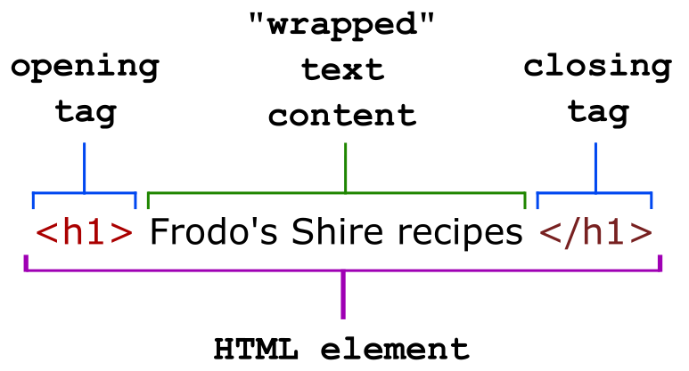
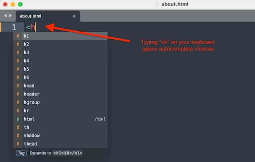
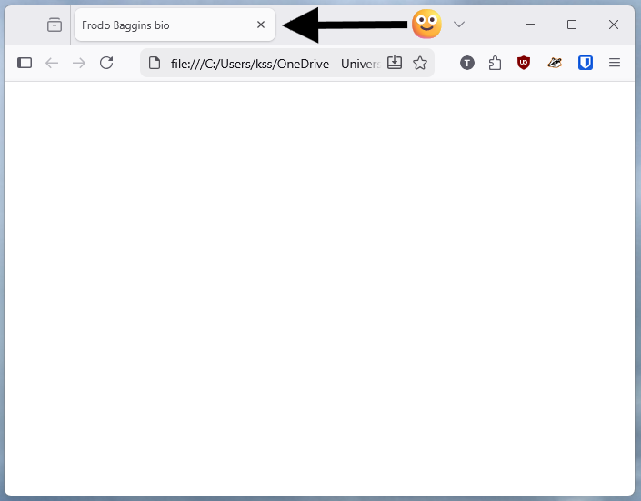
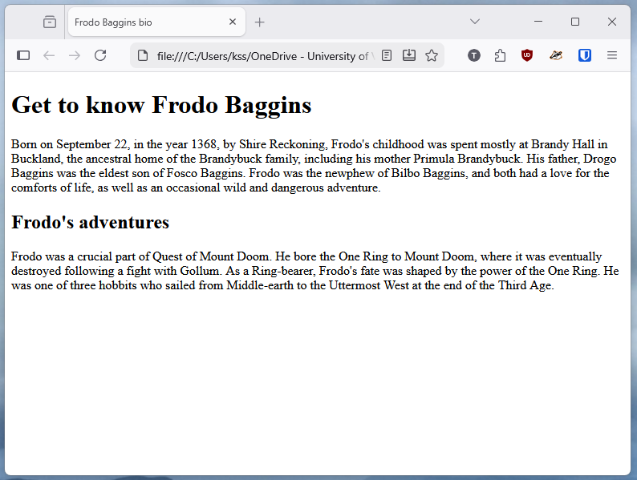

# Getting started with HTML

Our HTML page will look basic at first, but if you finish the workshop you will have something that looks like a complete web page, with images, links, and more. 

If you have any questions, or get stuck, please ask the instructor for assistance. 

The intention of this workshop is for you to create an "about me" page, but it doesn’t have to be about you. For the workshop as a whole, you can use the examples provided, or apply their techniques and principles and create your own work as you like. My example "about me" page will be about [Frodo Baggins](https://en.wikipedia.org/wiki/Frodo_Baggins). Have fun <span style='font-size:20px;'>&#128512;</span>

If you haven’t already, **please install [Sublime text editor](https://www.sublimetext.com/download) on your computer**. You are welcome to use any text editor you like, later, but our workshop examples use Sublime Text. We use this editor because it has some smart features that help to prevent errors and typos.


## Create a directory (folder)

- First, we are going to **create a new folder** (AKA a "directory"):
	-  **Windows users:** open **[File Explorer](https://support.microsoft.com/en-us/windows/file-explorer-in-windows-ef370130-1cca-9dc5-e0df-2f7416fe1cb1)** and select **Desktop**. Next, right click somewhere on the empty space in the Explorer window and select **New** > **New Folder** 
	- **Mac users:** right click (or Control + click) somewhere on the empty space on your desktop and select **New Folder**
- Name your folder as follows: `html_workshop`.

    <button onclick="toggle('gif1')">Show/Hide Animation</button>
    <div id="gif1">
     <br>
    </div> 

## Create an HTML document
This section will walk you through now to create, name, and save your first HTML file, or document, using Sublime Text. 

1. Open **Sublime Text**.
2. In the top left of the main menu, select **File** > **New File**. You should see an empty file with the title of "untitled." Next, we need to name and save our file.
3. In the main menu, select **File** > **Save as**, then navigate to the `html_workshop` folder we created earlier. Now, **name the file** exactly like this: **`about.html`**.
4. Finally, **click the Save button**. Sublime Text will now recognize your file as an HTML file because you used the `.html` extension, or suffix.

## Introducing HTML "tags"

HTML (Hypertext Markup Language) is a "markup" language, or a text-encoding system that defines the structure and formatting of a digitial "document," such as a web page. So, when we talk about "code" in this context, we are referring to "encoding." 

Like any language, HTML is an agreed-upon set of codes that define shared meanings. Another word for the act of encoding is "tagging." We use HTML "tags" to tell a web browser—such as Firefox, Safari, or Chrome—how to interpret and categorize specific content (text, images, videos, and so on). 

For example, we might want some part of our text, like a chapter title, to be a heading. A heading will stand out from the rest of the text by being larger and bolder than the text around it. In that case, we would use the HTML tag for a heading, and "wrap" a selection of text with that tag. The combination of a tag and the content within it is called an HTML element. 

Next, let's look at the anatomy of a tag.

**HTML tags have three elements:**
1. the **"opening" tag**, which has a descriptor symbol such as `h1` between two pointy, or angle, brackets: `<` and `>`; 
2. the **"closing" tag**, which has the same symbols as the opening tag, with a forward slash _before_ the descriptor—there are some tags that don’t need a closing bracket and these are called "self-closing" tags, but will ignore those for now; 
3. the **"content"**, which is everything between the opening tag and the closing tag. Browsers are designed to hide tags, but display the content between them. 



## Essential parts of a complete HTML document

When we talk about a "complete" or a "valid" HTML file, we are referring to what basic parts of an HTML file we need to have it pass current [web standards](https://en.wikipedia.org/wiki/Web_standards) for web browsers. Having a valid HTML file, or website, is important for a number of reasons. 

We want our site to load and look as expected. More important is that the Internet is intended, as explained on the [World Wide Web Consortium (W3C)'s website](https://www.w3.org/WAI/fundamentals/accessibility-intro/), "to work for all people, whatever their hardware, software, language, location, or ability. When the Web meets this goal, it is accessible to people with a diverse range of hearing, movement, sight, and cognitive ability." 

### DOCTYPE declaration

Browsers can open and display more than HTML files, so we need to "declare" what kind of file we have to the browser. 

Although not technically a tag (it is a "keyword"), a DOCTYPE declaration, or DTD, tells the browser what document type to expect. 

> **<mark>Note</mark>** that some tags are [case sensitive](https://en.wikipedia.org/wiki/Case_sensitivity), and some are not. In this case, "DOCTYPE" must be in all-caps.
<br>

1. In your `about.html` file, add the following at the top-left of the file: `<!DOCTYPE html>`
2. Save your file. 

### Adding your first HTML tag: the <html> tag

Now, we need to add the HTML tag. If you think of HTML tags as nesting dolls, this tag is the largest doll, with all other subsequent dolls/tags contained within it. 

1. In your `about.html` file, and underneath `<!DOCTYPE html>`, add the following : `<html></html>`
2. Save your file. 
> **<mark>Note</mark>** that Sublime Text is programmed to provide some HTML features, such as autocompletes, suggestions, and other features to make your "[markup](https://en.wikipedia.org/wiki/Markup_language)" work easier and more reliable. For example, try Sublime Text's autocomplete feature by typing the letter “**<h**”. Note that a dropdown list of suggestions will appear, giving you the option to autocomplete the line for you.
>
> Like autocomplete with texting, it is easy to make a mistake, so always make sure that you are selecting the correct choice.
> 
>

By now, your `about.html` file should look like this: 
    
	```
    <!DOCTYPE html>
    <html></html>
    ```

### The head tag: <head>

Head tags appear, as the name suggests, at the head of the document. The content within head tags tells important information to the browser. The head tag also contains an essential element of any HTML page: the page "title." 

Page titles typically appear in browser tabs, otherwise, the browser tab for your page would be blank. 

The head tag also contains essential "metadata," or data about data. Metadata in this case is data about the HTML document. With the exception of the `<title>` tag, elements within the `<head>` are _not_ displayed by your browser.

1. In your `about.html` file, place your cursor between the `<html></html>` tags and hit return at least three times. We are making some space for our new tags. Your `about.html` file should now look something like this:

    ```
    <!DOCTYPE html>
    <html>

	
    </html>
    ```
2. Directly underneath the opening `<html>` tag, add the follwing opening and closing `<head>` tags:
`<head></head>`
3. As you did for the `<html>` tags, make some space between the `<head>` tags. Then, add the following "meta" tag: <meta charset="UTF-8">
> **<mark>Note</mark>** that the **"charset"** (character set) attribute specifies the [character encoding](https://www.w3.org/International/articles/definitions-characters/) for the HTML document. By telling the browser to use "UTF-8" (**Unicode** Transformation Format–8 bit), rather than letting the browser guess, your web page will now be able to display nearly every character and symbol it is possible to display in a browser. Currently, "[Unicode](https://en.wikipedia.org/wiki/Unicode)" has nearly 160,000 characters and over 170 scripts, including emojis, symbols, ancient languages, and more. 
4. Save your file.
5. We are now going to add a title to our web page. Underneath the `<meta>` tag, add the following tags: `<title></title>`.
6. Save your file. Your `about.html` file should look like this:  

    ```
    <!DOCTYPE html>
    <html>
    <head>
    <meta charset="utf-8">
    <title></title>
    </head>
    </html>
    ```
7. Whatever you add between the `<title>` tags will appear in the tab of your web page. Between your `<title>` tags, add whatever text you like. In my example, I am writing a short biography of Frodo Baggins, so here is what my `about.html` page looks like at this stage:  
    ```
    <!DOCTYPE html>
    <html>
    <head>
    <meta charset="utf-8">
    <title>Frodo Baggins bio</title>
    </head>
    </html>
    ```
> **<mark>Note</mark>** that I kept my title short. Browser tabs are only so wide, and I want my readers to be able to see the whole title.
8. Save your file.

### Seeing your (blank) page for the first time
Now it is time to see what your `about.html` file looks like to a browser! 

1. Navigate to where you saved your `about.html` file.
2. Right click (or Control + click if you are on a Mac), and open with the browser of your choosing. In my case, this is what my file looks like in the Firefox browser:



Right now, all we should see is a blank page and the page's title in the browser tab. Now it is time to add some content to our page....

## Essential content of a basic HTML document 
Up to this point, we have learned what it takes to create to create a bare bones HTML file, that is, the bare minimum elements to have a browser recognize our `about.html` file as a web page. 

Next, we will add what web developers consider the basic elements of web page. After that, we will add some content to display. 

### The body tag: <body>
The `<body>` tag is appropriately named because that is where the body of your content—such as paragraphs, images, links, lists, and more—will be displayed on your web page. There can be only one set of `<body></body>` tags within an HTML file. 

1. Go back to Sublime Text and return to your `about.html` file.
2. Below the closing `</head>` tag (and above the closing `</html>` tag) add the following tags: `<body></body>`

Your file might have different content between the `<title>` tags, but should otherwise look like this:  
   
	```
    <!DOCTYPE html>
    <html>
    <head>
    <meta charset="utf-8">
    <title>Frodo Baggins bio</title>
    </head>
    <body></body>
    </html>
    ```  

Now, **let's do a little visual housekeeping**, as it can be easier to keep track of things when we separate out some of the elements from each other.

Here's what my file now looks like, for easier reading:  
    
	```
    <!DOCTYPE html>
    <html>

    <head>
    <meta charset="utf-8">
    <title>Frodo Baggins bio</title>
    </head>

    <body>
    </body>

    </html>
    ```

### The paragraph tag: <p>
Paragraph tags `<p></p>` tell that browser to treat the text between them as separate blocks of text, or paragraphs. 

All browsers by default will add a line break, or place a single blank line, before and after each set of `<p></p>` tags. Paragraph tags always appear, or are "nested," between the `<body></body>` tags. 

1. In your `about.html` file, make some space between the `<body></body>` tags and add two sets of paragraph tags. Then, add some space between the two sets of opening and closing `<p></p>` tags, as in the following example:  

    ```
    <body>

    <p></p>

    <p></p>

    </body>
    ```
2. Save your file.

_Before_ we add any content between the paragraph tags, **we are going to add one last element** seen in nearly all web pages, and that is a heading of some kind. 

### Headings tags: \<h1> to \<h6>
Headings can give structure and readability to your web pages. They help to break up long sections of text and are crucial for those using assistive technologies to provide in-page navigation of your content. 

There are **six types of heading tags**, from largest to smallest: `<h1>`, `<h2>`, `<h3>`, `<h4>`, `<h5>`, and `<h6>`. 

Browsers have built-in ways to display headings so that they have different sizes. You can see a demonstration of what each heading looks like on [the W3Schools website](https://www.w3schools.com/tags/tryit.asp?filename=tryhtml_headers). 

1. In your `about.html` file, and above your top set of `<p></p>` tags, place the following heading tags: `<h1></h1>`
2. Above your bottom set of `<p></p>` tags, place the following heading tags: `<h2></h2>`
3. Save your file.

Your `about.html` file should now look like this:  
    
	```
    <!DOCTYPE html>
    <html>

    <head>
    <meta charset="utf-8">
    <title>Frodo Baggins bio</title>
    </head>

    <body>

    <h1></h1>

    <p></p>

    <h2></h2>

    <p></p>

    </body>

    </html>
    ```

Now that we have all the basic elements in place, it is finally time to add some content <span style='font-size:20px;'>😍</span>

## Adding content to our HTML document
All the content between the tags we added within the `<body></body>` tags will be displayed on our web page. 

1. You can add whatever content you want, or copy/paste the content from my Frodo Baggins bio page. Be careful to copy only the content _between_ the tags, and be sure to place this same content betwen the equivalent tags in your `about.html` file:  

    ```
    <body>

    <h1>Get to know Frodo Baggins</h1>

    <p>Born on September 22, in the year 1368, by Shire Reckoning, Frodo's childhood        was spent mostly at Brandy Hall in Buckland, the ancestral home of the Brandybuck       family, including his mother Primula Brandybuck. His father, Drogo Baggins was the      eldest son of Fosco Baggins. Frodo was the nephew of Bilbo Baggins, and both had a      love for the comforts of life, as well as an occasional wild and dangerous              adventure.</p>

    <h2>Frodo's adventures</h2>

    <p>Frodo was a crucial part of Quest of Mount Doom. He bore the One Ring to Mount       Doom, where it was eventually destroyed following a fight with Gollum. As a Ring-       bearer, Frodo's fate was shaped by the power of the One Ring. He was one of three       hobbits who sailed from Middle-earth to the Uttermost West at the end of the Third      Age.</p>

    </body>
    ```

**Remember to Save your file.**

Putting it all together, here is what your `about.html` file should look like by now:  

```
<!DOCTYPE html>
<html>

<head>
<meta charset="utf-8">
<title>Frodo Baggins bio</title>
</head>

<body>

<h1>Get to know Frodo Baggins</h1>

<p>Born on September 22, in the year 1368, by Shire Reckoning, Frodo's childhood was spent mostly at Brandy Hall in Buckland, the ancestral home of the Brandybuck family, including his mother Primula Brandybuck. His father, Drogo Baggins was the eldest son of Fosco Baggins. Frodo was the nephew of Bilbo Baggins, and both had a love for the comforts of life, as well as an occasional wild and dangerous adventure.</p>

<h2>Frodo's adventures</h2>

<p>Frodo was a crucial part of Quest of Mount Doom. He bore the One Ring to Mount Doom, where it was eventually destroyed following a fight with Gollum. As a Ring-bearer, Frodo's fate was shaped by the power of the One Ring. He was one of three hobbits who sailed from Middle-earth to the Uttermost West at the end of the Third Age.</p>

</body>

</html>
```

Now, let's check out our work in a browser.  

### Testing our basic HTML page
It is time to see if everything on your `about.html` web page looks as expected. 

1. As you did earlier, navigate to where you saved your `about.html` file.
2. Open your file with the browser of your choosing. Here is what my web page looks like in Firefox:



Congratulations for making your first complete HTML web page. <span style='font-size:20px;'>&#127881;</span> 

Now that we have a basic HTML page started, it's time time to learn about adding links and images. So, let's move on the next section in our workshop....

<script>  

    function toggle(input) {
        var x = document.getElementById(input);
        if (x.style.display === "none") {
            x.style.display = "block";
        } else {
            x.style.display = "none";
        }
    }
</script>

[NEXT STEP: Adding Images and Links in HTML](https://uviclibraries.github.io/html-css/act-2.html){: .btn .btn-blue }

