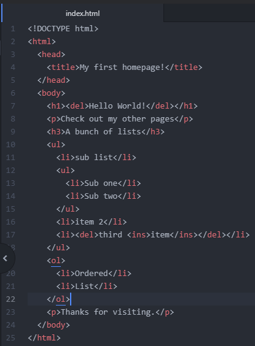
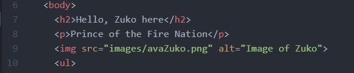
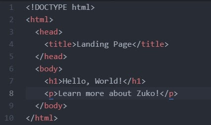

# Adding Images and Links in HTML

Next we’ll be learning about adding images, and links to other pages. If you and your group have any questions, or get stuck as you work through this in-class exercise, please ask the instructor for assistance. Have fun!

1.  If you haven’t already completed the first exercise, please start [here](https://richmccue.github.io/html-css/act-1.html){:target="_blank"}, as this part builds on the topics from the previous section.
2.  So far, you should have an about me page with some paragraphs, headers, and a list. You may have added some text tags as well! We are now going to add additional pages and some images. Your HTML document should look something like the following:

    

3.  **Image Tag**
    -   First off, inside your “html_workshop” folder create another folder called “images”. You can do this in Atom by rightclicking the project tab and selecting “**New Folder**” and naming it within Atom.
    -   If your page is about Zuko, click on the image below, and then save it into that folder else use a photo appropriate to your about me page.
    
        
    
    -   **&lt;img&gt;** is the tag for images. Notice there is no closing tag. This happens because “img” is a self closing tag. You may see it written as **</img>** to show that it is self closing but this is just for readability. Both work and the important thing is to keep it consistent.
    -   Using atom’s Autocomplete while typing img you’ll end up with: 
**&lt;img src ="" alt=""&gt;**
    -   If you didn't use autocomplete, type out the above so “src” and “alt” are in your “img” tag.
    -   Let's add the image to our page. My image is saved as a png file but img accepts various types, the most common ones being:
        -   .gif
        -   .jpeg
        -   .svg
    -   **src** stands for source and is where HTML will look to grab the image. My image is stored in the image folder and under the name “avaZuko.png”. Between the quotation marks we put the path to get to our jar.jpg file. The path is the following “images/avaZuko.png”. This is called a relative path, as it works from the current folder and if we moved the image.html file to a different folder it would not be able to find the image as it would be a different path. How it works is from where the current file is (in our case about.html) and first opens the images folder then looks for the file avaZuko.png. If you want the path to go to the parent folder, it is written as “../”.
    -   The **alt** stands for alternative and is what will be displayed when the image fails to load, cannot be found or is read aloud for individuals who may have visual disabilities.
    -   Save the file and refresh your browser to see the changes.
    
        
    
    -   Add another image at the bottom of your page. You can use the fire nation image below if you don't have any images of your own to use.

        

4.  We will need a new file for our new page. Under, File, select “New File” and a new tab will open. If you notice that Atom is not changing colors for your text, it's probably because it doesn't know what kind of file you are using and the default is a Plain Text file. To change this save the file as a HTML file. I’ve named mine “images.html”. Make sure to save it in the same folder as our index file. Once saved you should see it on the project tab on the left in Atom.
5.  **Links (a Tags)**
    -   To navigate between different pages we need links to know where we are going. This is where anchor tags, **&lt;a&gt;&lt;/a&gt;**, come in to play.
    -   First thing to do is find where on your page you want to create a link and where you want that link to go. On the Zuko page, I’m going to make a link from  the word tea to the wikipedia page on tea.
    -   Surround the word (or even **** tag if you so choose) you want to use to be the hyperlink like so: 
**&lt;a&gt;**tea**&lt;/a&gt;**
    -   Within the opening tag, after the a, type “ **href =””** ”. Type in the hyperlink for the desired website between the double quotes: 
**&lt;a href = “https://en.wikipedia.org/wiki/Tea”&gt;**tea**&lt;/a&gt;**
    -   Save and refresh your page and you’ll be able to see that the text appears different and when clicked, goes to the linked website.
    -   This kind of link is called an absolute path. It doesn't matter where the file is saved the link will go to the intended site. A relative path is when the link is based on the current location of the file. Relative links are great for maneuvering between pages on the same site.
    -   First thing we’ll need to do is create another file to have a relative path to start from.
    -   create a new html file, let’s call this one index.html. This page will be our home page or landing page. Include the following tags:
        -   &lt;!DOCTYPE html&gt;
        -   &lt;html&gt;&lt;/html&gt;
        -   &lt;head&gt;&lt;/head&gt;
        -   &lt;title&gt;&lt;/title&gt;
        -   &lt;body&gt;&lt;/body&gt;
        -   &lt;h1&gt;&lt;/h1&gt;
        -   &lt;p&gt;&lt;/p&gt;
    -   Remember to save it in your “html_workshop folder”
    
        
        
    
    -   Using relative paths for anchor tags works the same as paths for image sources. Since the files are saved in the same location, the link will just be the file name: 
**&lt;a href = "about.html"&gt;**Zuko**&lt;/a&gt;**
    -   Whatever is between the anchor tags becomes the link. Our anchor tags surround some text within a paragraph, but could encompass paragraph, image, and even body tags. Changing where the anchor tags start and end change what needs to be clicked to go to the desired page.
    -   Back on your about page, let's put a link to go back to the index page.
    -   Add a paragraph to the bottom of the about page and make it a link to the index page.
6.  Note: it’s best to save your files without spaces in the name as it can look strange in the url bar. Instead, replace spaces with underscores or dashes. The same goes for image files. **For Example:** “Image page.html” should either be:
    -   “Image_page.html”
        **or**
    -   “Image-page.html”

[NEXT STEP: Adding CSS](act-3.html){: .btn .btn-blue }
