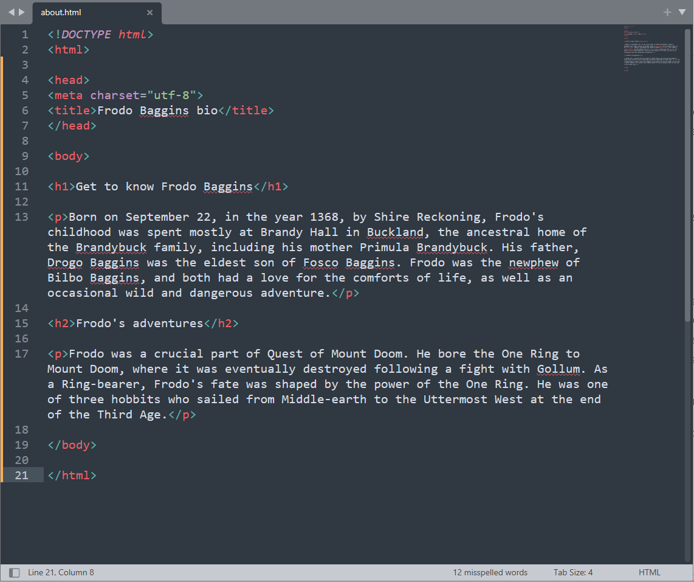
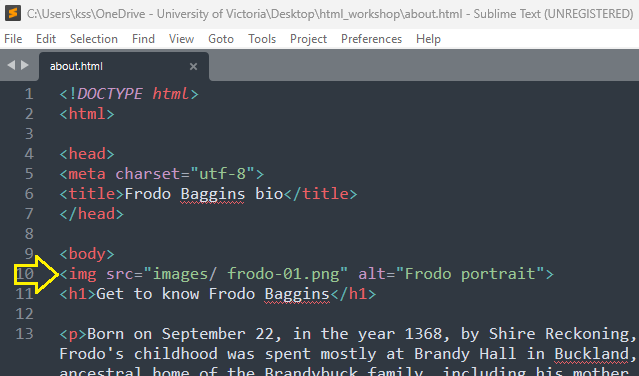
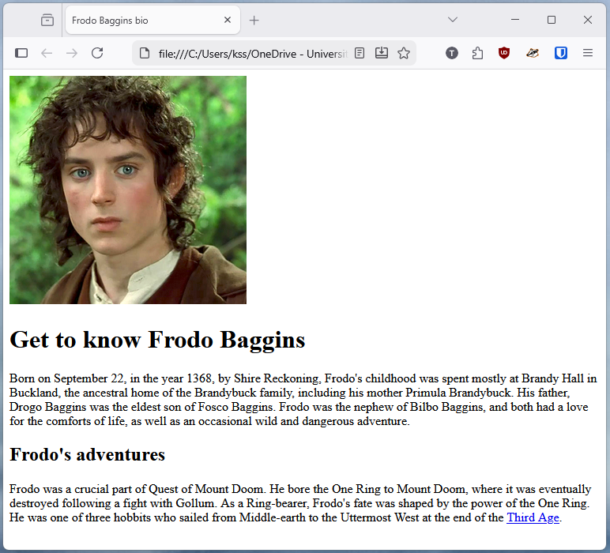
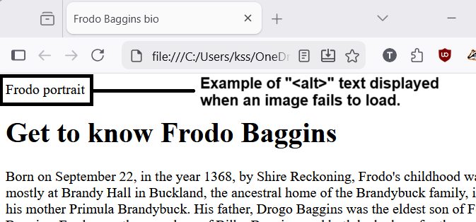
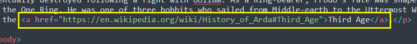

# Adding Images and Links in HTML

If you haven’t already completed the first exercise, please go to [Getting Started With HTML](https://uviclibraries.github.io/html-css/act-1.html).

Assuming that you are following along and making your own "Frodo Baggins bio" web page, your `about.html` file (in the Sublime Text editor) should looks like this: 

In this section, we’ll learn how to add images and links to an HTML page. 

We are starting with images because this will help us to better understand and practice the relationships between folder and file locations. 

## Adding images to an HTML document

Images come in all shapes and sizes, as well as "formats", or file types.  

The [most common image file types on the internet](https://w3techs.com/technologies/overview/image_format) are PNG (Portable Network Graphics) and JPEG (Joint Photographic Expert Group image). PNG files end with the `.png` extension (or suffix) and JPEG files typically  end with `.jpg` or `.jpeg`. 

You have likely seen [other file formats](https://en.wikipedia.org/wiki/Image_file_format), but we will be working with a PNG file, as this file type strikes a good balance between image quality and file size. In this case, file size does not mean its scale (the length of its height x width), but how much storage space the file requires. 

### Create a place to store your image

Let's start by creating a place to store our image. 

1. On your computer, navigate to the `html_workshop` folder and open it.
2. In the `html_workshop` folder, create another folder called `images`.
3. Click on the following link: [Frodo portrait](https://upload.wikimedia.org/wikipedia/en/4/4e/Elijah_Wood_as_Frodo_Baggins.png) and save the file into the `images` folder you just created. If the previous link does not work for you, I have uploaded the identical file [here](https://raw.githubusercontent.com/uviclibraries/html-css/refs/heads/main/images/act-2/frodo.png).
4. Rename your PNG image file as follows: `frodo-01.png`. This may seem like a trvial step, but it will pay off later, should we wish to add more images of Frodo.

> **<mark>Note</mark>**: if the process of saving images from the internet to your computer is new to you, or if you get into the digital weeds, please reach out to your intstructor. If you are doing this workshop remotely, then [this web page](https://tecnobits.com/en/how-to-download-images-from-the-internet/) walks through the process.

Now that we have created a place to store our image, and renamed it, we are going to get the image to appear on our HTML page.

### Make an image appear on your HTML document: the \ tag

To get our image to appear on our web page, we are essentially creating a "link" (_not_ an HTML hyperlink: we learn about those soon) between the image in our `images` folder and our `about.html` page. 

Another way of thinking about this is that we are going to tell the HTML file what "path" to take to get to the image, or the "file path" we want to use. 

HTML uses an "**image tag**," or`` tag, to "embed" an image in a web page. One quirk of an `` tag is that it **does not need a closing tag**. But, it does have **two requirements**: 

- (1) it **must contain the `src`**, or "source" attribute, which provides the [file path](https://www.w3schools.com/Html/html_filepaths.asp) information for your image (or [other file types](https://www.w3schools.com/tags/att_src.asp)). 
- (2) it **must contain `alt` text**, or "[alternate text](https://w3htmlschool.com/the-alt-attribute-in-html/)" attribute, to describe the image for a screen reader, or the text to display in cases where the image might fail to load for someone.

1. In Sublime Text, return to your `about.html` file.
2. Underneath the opening `<body>` tag, add the following file path information exactly as written: ``. Here is an image of what this looks like in my `about.html` file:  

3. Save your file.
4. Open the file in your browser and see if your image appears. Here is what mine now looks like in Firefox:  

5. In Sublime Text, return to your `about.html` file. We are now going to break something on purpose to learn a valuable lesson.
6. In the `` tag, add a space between `images/` and `frodo-01.png`. So, the full `` tag will change as follows: 
- Before: ``
- After: ``
7. Return to your browser and [refresh](https://www.wikihow.com/Force-Refresh-in-Your-Internet-Browser) it. You should no longer see the portrait of Frodo. Instead, you should see only the "alt text," that is, the text between the double quotation marks in `alt="Frodo portrait"`. Here is my example:

8. In Sublime Text, return to your `about.html` file and remove the space you added in step 6.
9. Save your file.

**Breaking our image's file path teaches us several things.** First, if you cannot see an image on your web page, it could be that you have accidentally introduced a typo of some kind. Maybe you added a space somewhere, or there are differences between the name of your image file and what you wrote in the file path. 

Second, this lesson reminds us of the value in adding `alt` text. Screen-reader users rely on clear and concise `alt` text to navigate and experience web pages. This text can also be helpful in cases where your images do not load, for whatever reason. At the very least, someone visiting your broken web page will know the type of image _should_ be there. 

As with "hyperlinks," or "links," file path accuracy is important. Now that you have added an image to your growing web page, it is time to add a link. 

## Adding hyperlinks to an HTML document: the \<a> tag

HTML links are fundamental to websites. Links literally act as links from your web page to other web pages and other forms of content. This content can be other websites, a different page within your own website, or even a different spot on the same web page. 

### Get to know the `<a>` hyperlink tag

Here is an example of a complete [hyperlink tag](https://www.w3schools.com/tags/tag_a.asp) for an Internet URL (Uniform Resource Locator) web address: `<a href="https://www.wikipedia.org/">Wikipedia</a>`.

The content between the open and closed `<a>` tags will appear as a clickable link in your browser. In the example given, the word "Wikipedia" would appear as the clickable hyperlinked text.

The `<a>` in the hyperlink tag defines it as a hyperlink element, and the `href` is the attribute that indicates the link's destination.

**Hyperlinks have four basic types:**
  - **"external links"** link you to other locations outside of your directory, or folder(s), such as other web pages. External links always use a full URL (the whole `https://www` part). **Example: `<a href="http://www.wordpress.com/my-webpage.html">clickable text</a>`**.
  - **"internal links"** link you to other locations within your directory, such as other web pages wuthin in your own website. These links do _not_ use the full URL. **Example: `<a href="about-me.html">clickable text</a>`**.
  - **"anchor links"**, or hashtag links, "jump" you to locations within the same webpage. These are helpful in pages with a lot of text. You can, for example, create a table of contents at the top of your HTML page that jumps to sections (or text) within that same page. **Example: `<a href="#anchor-location">clickable text</a>`**.
  - **"email links"** link you to an email address. When you click on these, they tell your computer to open up whatever email program you are using. **Example: `<a href="mailto:some-email@yoursite.com">Email me</a>`**.

In this workshop, **we will be adding an external link**, but you are free to play with other kinds later, using the resources provided at the end of this section. 

### Add an external link to your HTML document

In my "Frodo Baggins bio" page, I will be adding a link to the words "Third Age," as I want my readers to learn more about where Frodo's adventures sit within the broader history of Middle Earth. 

1. In Sublime Text, return to your `about.html` file.
2. Wrap the words "Third Age" in the following tags: `<a href="">Third Age</a>`
3. Between the double quotation marks in the `href` attribute, add the following link: `https://en.wikipedia.org/wiki/History_of_Arda#Third_Age`. **Make sure that you do not add any accidental spaces before or after your URL.** Here is my example:  

> **<mark>Note</mark>**: if the text is too small to read in the above screenshot example, right click (or Control + click for Mac users) and select "Open image in a new tab"
4. Save your file.

### BONUS work: add an anchor link to your HTML document  

**Skip this section if you are feeling pressed for time**, or if you would rather move on to learning about Cascading Style Sheets (CSS) (how to change the look your `about.html` file). 

**Anchor links jump you to another place in the same page** based on where you place an "anchor" within it. **<mark>Note</mark>** that you need to add enough text content  that so that you have to scroll down in Sublime Text to get to the end of it. 

If you need to copy in some more random text into your `about.html` file, you can use "placeholder text" called "[_lorem ipsum_](https://en.wikipedia.org/wiki/Lorem_ipsum)." This gibberish text is often used by web developers for creating website examples. 

People like to have fun inventing their own versions of _lorem ipsum_, and my current favourite is, of course, [_The Lord of The Rings_ _lorem ipsum_ generator](https://ceheiss.github.io/LordOfTheIpsum/).

In overall terms, anchor links require that we wrap a selection of text in a unique identifyer, or ID, and then link to that ID from another part of the same web page. In fact, the link we used in our external link example, above, is an anchor link. 

**You can tell an anchor link because it will have a hashtag in it**: `https://en.wikipedia.org/wiki/History_of_Arda#Third_Age`

**Follow [this tutorial](https://www.w3docs.com/snippets/html/how-to-create-an-anchor-link-to-jump-to-a-specific-part-of-a-page.html), if you want to play with anchor links in your `about.html` file.**

Once you are done, **return to this page to move on the next part of this workshop.** 

Excellent! Now you know how to add images and links to a web page &#128526; 

Let's move on the final part of this workshop: changing the look and feel of your web page using CSS, or Cascading Style Sheets... 

[NEXT STEP: Adding CSS](https://uviclibraries.github.io/html-css/act-3.html){: .btn .btn-blue }
