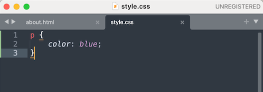
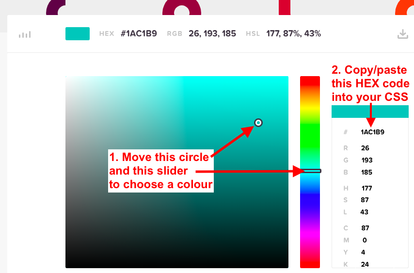
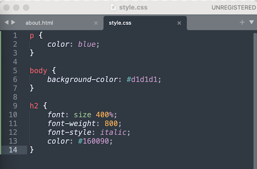

# Introducing CSS

If you haven’t already completed the previous exercises, please start on the [Getting Started With HTML](https://uviclibraries.github.io/html-css/act-1.html) page, as this part builds on the topics from previous sections.

This section of the workshop is on Cascading Style Sheets (CSS). **Think of HTML as the builder and CSS as the artist.** CSS is a different language than HTML and has different rules and structure. 

CSS is used to alter the presentation of a website. Basically, CSS tells browsers the rules for what your various HTML elements, like paragraphs (`p`), headings (`h1`, for example), and content should look like. CSS also controls things like the size and spacing between objects, like images, and text, and so much more. 

Getting CSS to work the way you want to can sometimes try your patience, but it is worth it when things work, so stick with it and be prepared to have fun breaking things! 

If you have any questions, or get stuck, please ask the instructor for assistance. Have fun!

**On our journey, so far**, you should have a couple of HTML pages, with a list, some links, and a mix of text an images. Visually speaking, it looks fairly basic. Here's an example of what my `about.html` page looks like at this point: 


Using CSS, we will make our growing website look a little more stylish and colourful.

## Linking CSS to your HTML content

- We are going to create new file, or "style sheet," for our CSS, and this file will also have an extension name, or suffix, of `.css`.
- The CSS "rules" for modern, complex websites can be very complicated, with multiple style sheets applying multiple rules to HTML files. We are going to keep things simple to start with and use just one style sheet.  
- In Sublime, create a new file in your `html_workshop` folder and name it exactly as follows: `style.css` 
- In the same way that we created a link to an image file, in our `about.html` page, we are going to create a link between an HTML file and a CSS file. We make this HTML > CSS connection possible by adding a link to an HTML page. 
- In Sublime, open your `about.html` page. 
- The link to our style sheet will be placed within the `<head></head>` tags in our `about.html` page. It will look like this:

`<link rel="stylesheet" href="style.css">`

Here is an example of what the stylesheet link looks like in my `about.html` page:

 ```
    <head>
        <title>About Me</title>
        <link rel="stylesheet" href="style.css">
    </head>
```
- Notice that I place the stylesheet link just _above_ the closed `</head>` tag. 
- Before we add our stylesheet link, let's get to know more about it. 
  - Notice that this is a "self-closing" link, in that it has no forward slash `/`.
  - The first of the two parts in the link is `rel`, which stands for "relation", and this is required for all “link” tags.
  - The second of the two parts in the link is `href`, which stands for "hypertext reference". This specifies the location of another page, just like the `href` in our external links we did in the previous section of this workshop. 
  - The `href` points our HTML page to our `style.css` page.    
- In your `about.html` page, add this style sheet link just above the closed `</head>` tag: `<link rel="stylesheet" href="style.css>`.
- Save your `about.html` page.
- Our style sheet should now be linked to our `about.html` page. 
- CSS code can be used within an HTML file, but to keep things simple we will only use CSS code in our CSS file.
- <mark>Note</mark> that you may need to hard refresh (clear your cache) in your browser to see your CSS rules take effect in your `about.html` page.

## Get to know CSS

- Here is an example of a "CSS declaration block," which contains an ordered collection of CSS properties and values:<br/>



- The declaration block "declares" what it will do to change a specific HTML element, such as a paragraph `<p>`. 
- In CSS-speak, the HTML element you want to change, or "style," is called the "selector". So, let's put this all together:<br/>


- Note that the CSS declaration lives within "**curly brackets**" `{` `}`. Think of these curly brackets like the open and closed tags in HMTL. 
- The example above shows all the "values" that would apply to any and all `h1` tags in your HTML file.
- Note the use and placement of the **semicolon(s)**. Semicolons signify the end of individual declarations. 
- <mark>Important</mark>: always add a semicolon at the end of each declaration. Do not (accidentally) add any spaces before the semicolon or your declaration will be "invalid" and not work: 
  - Invalid: `color:blue ;`
  - Valid: `color:blue;`
- Note that CSS is written with USA spelling, so it's "color" not "colour". 
- A declaration block can hold multiple properties. Each property should be on its own line because it makes the block easy to read. 
- Technically, it does not matter what order we place our declarations. Modern computers and browsers read CSS very quickly. However, if you had a large CSS file, with hundreds of declarations, page-load times can be affected and it will be important to keep your CSS tidy and easy to read.
- For reasons of speed, readability, and more, web developers typically use a variety of CSS best practices, which you will encounter eventually if you carry on in web development.
- Here is an example of a well formed CSS "ruleset" (which contains the selector, declarations, properties, and values):
        
 ```
 h1 {
      text-decoration:underline;
      font-size:25px;
      color: blue;
 }
```
- In the example above, we are telling browsers to do the following: make all our `h1` headings underlined, 25 pixel font size, and blue in colour. 

Now it is time to start playing with CSS... 

## Add CSS to your `about.html` page
    
<!--  -->
### Playing with colours

- Just to play around, let's change the colour of all the text within our `<p>` tags. 
- Copy/paste the following CSS code into your `style.css` file: 

 ```
 p {
      color: blue;
 }
```
- Save your `style.css` file, then open your `about.html` page in your browser to see the changes. If you have blue text, then your CSS is working. If not, try the following solutions:
  - (1) hard refresh your browser; 
  - (2) ensure that your CSS is correct (with no typos or spaces in the wrong places); 
  - (3) make sure that the stylesheet link (`<link rel="stylesheet" href="style.css>`) in your `about.html` page is correct. 
- If everything is working as expected, try some different colour values for your text, changing the `blue;` to other colours. 
- CSS has multiple options to indicate colour values. You can write colour names, such as `pink`, `orange`, `grey` and so on. Or, you can be more precise and choose from several alphanumeric (mixes of numbers and letters) value formats: 
  - RGB [Red Green Blue (↪)](https://www.w3schools.com/css/css_colors_rgb.asp), and RGBA (Red Green Blue Alpha)
  - HSL [Hue Saturation lightness (↪)](https://www.w3schools.com/css/css_colors_hsl.asp), and HSLA (Hue Saturation Lightness Alpha)
  - HEX [Hexadecimal (↪)](https://www.w3schools.com/html/html_colors_hex.asp)
- With so many options, how do we know which standard to use? As with all things technological, each colour value format has its pros and cons, and its defenders and detractors. 
- **HEX colours**, or codes, are a great place to start because each colour has a unique code that you can copy/paste into your CSS value. 
- Let's change the `blue` value in our CSS file to its HEX code equivalent by replacing `blue` with the following code: `#0000FF`, as in the following example: 

 ```
 p {
      color: #0000FF;
 }
```
- Note that in HEX language, `#000000` is 100% black (technically, no colours) and `#FFFFFF` is 100% white (technically, all colours).
- If you have time, try this online colour picking tool: [htmlcolorcodes (↪)](https://htmlcolorcodes.com/). 



- **<mark>Important</mark>**: make sure that you always include a hashtag `#` as part of the HEX code. 
- Now, let's make our `about.html` page a little more dramatic and change the colour of the whole page. What we are doing, really, is using CSS to add a colour value to the `<body>` tag, but since nearly all our HTML content appears between these tags, it changes the whole page. 
- Copy/paste the following CSS in your `body` selector: `background-color: #59b1c2;'
- Here is my example:

```
body {
    background-color: #59b1c2;
}
```
- Save your CSS file and have a look at your `about.html` page in your browser. 
- Feel free to try other colour values! 

### Playing with text

- CSS does far more than change colours, so let's move on to another CSS fundamental: **changing the look of text**. 
- The following table lists some changes that you can make to text. In our `about.html` page, you could apply these changes to headings (`h1`, `h2`, `h3`, etc.), or paragraphs (`p`), or lists (`ul`, or `ol`). 
- **Choose some properties and their corresponding values from the following table** and see if you can get them to work on your text. 
- Remember to **save your `about.html` file and refresh your browser as you confirm your changes:** 

| Properties to apply to your text       | Some value options to try       | Notes  |
|:-------|:-------|:-------|
|`font-size:`| `25px`, `50%`|[font size (↪)](https://www.w3schools.com/css/css_font_size.asp) is expressed in several ways. We have given two examples. First, try `px`, or pixel size. Delete that, then try `%`, or percentage, changing the numbers for each to see what happens. |
| `font-style:`| `italic`|[font style (↪)](https://www.w3schools.com/css/css_font_style.asp) has three options: `normal`, `italic`, and `oblique`, but it's mostly used for italicizing text. |
| `font-weight:`| `bold`, `800`|[font weight (↪)](https://www.w3schools.com/cssref/pr_font_weight.php) can be expressed as a name, as in `normal`, `bold`, `bolder`, and `lighter`, or you can use a numeric value. In the example given, `800` is considered "extra bold". |
| `text-align:`| `center`, `left`, `right`|[font weight (↪)](https://www.w3schools.com/cssref/pr_font_weight.php) can be expressed as a name, as in `normal`, `bold`, `bolder`, and `lighter`, or you can use a numeric value. In the example given, `900` is considered "extra bold". |
| `text-transform:`| `uppercase`, `lowercase`, `capitalize`|[text transform (↪)](https://www.w3schools.com/cssref/pr_text_text-transform.php) is helpful when you want to change text to look a certain way no matter what the source text looks like. For example, miXeD CaSe words would appear as ALL CAPITALS if you applied the `uppercase` value.|
| `letter-spacing:`| `15px`, `.0625em;`|[letter spacing (↪)](https://www.w3schools.com/cssref/pr_text_letter-spacing.php) controls the distance between the individual letters in words. This is usually applied to headings, or to make close-lettered fonts more readable. You can use a pixel (an  absolute) value or you can use an "em" (a relative) value. The relative value is relative to what a browser considers the size of the base font, which, in the absence of any applied CSS rules, is 16px. So, `1em` = 16px and `2em` = 32px. One "em" was traditionally defined as the width of the capital "M" in a given typeface. You can try negative values, too, like `-2px` and `-1em`. |

<!--  -->

**Let's put it all together!** Here's an example of my CSS changes... 

- First, this is the CSS code (which you could copy/paste): 

```
p {
    color:#ac0095;
}

body {
    background-color: #d1d1d1;
}

h2 {
    font: size 400%;
    font-weight: 800;
    font-style: italic;
    color: #160090;
}
```

- Second, this is what it looks like in Sublime: 



- Third, this is what it looks like in a browser, in my case, Chrome: 


I have managed to make something that looks like a website from the late 90s! But, that's ok because we are just playing around. 

CSS can do much more than we have tried, so far, and it can take years to learn its subtleties. Be patient and be prepared to spend far more time than you think trying to fix things. 

Next, we will take a look at some of the ways in which CSS can control the placement and arrangement of objects, like blocks of text, headings, and images, on a web page.... 

[NEXT STEP: Using CSS to Change Layout](act-4.html){: .btn .btn-blue }
