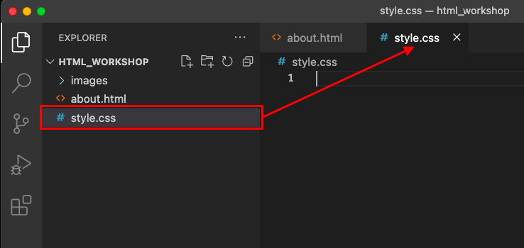
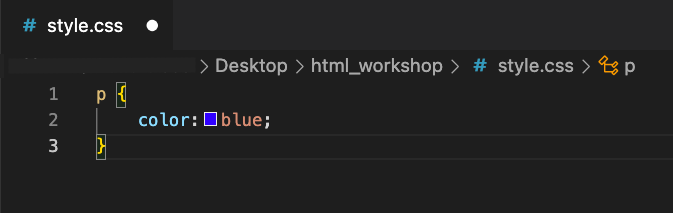
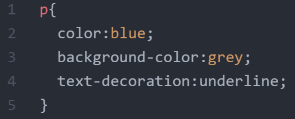
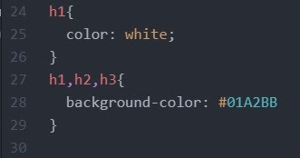
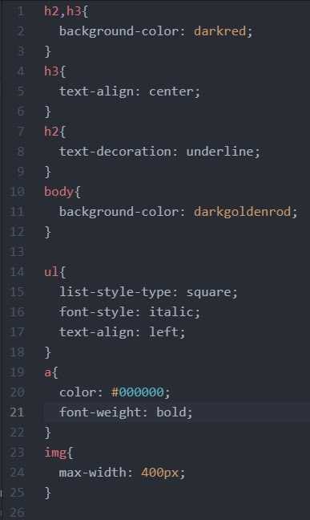

# Introducing CSS

If you haven’t already completed the previous exercise, please start [here](https://uviclibraries.github.io/html-css/act-1.html), as this part builds on the topics from the previous section.

This section of the workshop is on Cascading Style Sheets (CSS). **Think of HTML as the builder and CSS as the artist.** CSS is a different language than HTML and has different rules and structure. 

CSS is used to alter the presentation of a website. Bascially, it creates the rules for what your various HTML elements, like paragraphs (`p`), headings (`h1`, for example), and content will look like in a browser. CSS also controls things like the size and spacing between objects, like images, and text, and so much more. 

Getting CSS to work the way you want to can sometimes try your patience, but it is worth it when things work, so stick with it and be preared to have fun breaking things! 

If you have any questions, or get stuck as you work through this in-class exercise, please ask the instructor for assistance.  Have fun!

**On our journey, so far**, you should have a couple of HTML pages, with a list, some links, and a mix of text an images. Visually speaking, it looks fairly basic. Here's an example of what my `about.html` page looks like at this point: 


Using CSS, we will make our growing website look a little more stylish and colourful.

## Linking CSS to your HTML content

- We are going to create new file, or "style sheet," for our CSS, and this file will also have an extension name, or suffix, of `.css`.
- The CSS "rules" for modern, complex websites can be very complicated, with multiple style sheets applying multiple rules to HTML files. We are going to keep things simple to start with and use just one style sheet.  
- In the Visual Code Studio (VCS) editor, create a new file in your `html_workshop` folder and name it exactly as follows: `style.css` 



- In the same way that we created a link to an image file, in our `about,html` page, we are going to create a link between an HTML file and a CSS file. We make this HTML > CSS connection possible by adding a link to an HTML page. 
- In VCS, open your `about.html` page. 
- The link to our style sheet will be placed within the `<head>` tags in our`about.html` page. It will look like this:

`<link rel="stylesheet" href="style.css>`

- Before we add our stylesheet link, let's get to know about more about it. 
  - Notice that this is a "self-closing" link, in that it has no forward slash `/`.
  - The first of the two parts in the link is `rel`, which stands for "relation" and is required for all “link” tags.
  - The second of the two parts in the link is `href`, which stands for "hypertext reference" and specifies the location of another page, just like the `href` in our external links we did in the previous section of this workshop. 
  - The `href` points our HTML page to our `style.css` page.    
- In your `about.html` page, add this style sheet link just below the open `<head>` tag: `<link rel="stylesheet" href="style.css>`.
- Save your `about.html` page.
- Our style sheet should now be linked to our `about.html` page. 
- CSS code can be used within an HTML file, but to keep things simple we will only use CSS code in our CSS file.
- <mark>Note</mark> that you may need to hard refresh your browser to see your CSS rules work on your `about.html` page.

## Get to know CSS

- Here is an example of a "CSS declaration block," which contains an ordered collection of CSS properties and values:<br/>



- The declaration block "delcares" what it will do to change a specific HTML element, such as a paragraph `<p>`. 
- In CSS-speak, the HTML element you want to change, or "style," is called the "selector". So, let's put this all together:<br/>


- Note that the CSS declaration lives within "**curly brackets**" `{` `}`. Think of these curly brackets like the open and closed tags do in HMTL. 
- The example above shows all the "values" that would apply to any and all `h1` tags in your HTML file.
- Note also the use and placement of the **semicolon(s)**. Semicolons signify the end of individual declarations. 
- <mark>**Important**</mark>: always add a semicolon at the end of each declaration. Also, do not (accidentally) add any spaces before the semicolon or your declaration will not work, or be "invalid": 
  - Wrong (invalid): `color:blue ;`
  - Correct (valid): `color:blue;`
- Note that CSS is written with USA spelling, so it's "color" not "colour". 
- A declaration block can hold multiple properties. Each property should be on its own line because it makes the block easy to read. 
- Technically, it does not matter what order we place our delcarations. Modern computers and browsers read CSS very quickly. However, if you had a large CSS file, with hundreds of declarations, page-load times can be affected and it will be important to keep your CSS tidy and easy to read. For reasons of speed, and more, web developers have developed a set of best practices around using CSS, which you will encounter eventually if you carry on in web development.
- Here is an example of a well formed CSS "ruleset" (which contains the selector, declarations, properties, and values):
        
 ```
 h1 {
      text-decoration:underline;
      font-size:25px;
      color: blue;
 }
```
- In the example above, we are saying this with our CSS: that we want all `h1` headings to be underlined, 25 pixel fint size, and blue in colour. 

Now it is time to start playing with CSS... 

## Add CSS to your `about.html` page
    

    
- Note: not every single colour has been made available in word form. You can look up those that are available here. For colours not available, we can use its hexadecimal code. You’re probably familiar with decimal numbers: 0, 1, 2, 3, 4, 5, 6, 7, 8, and 9. Hexadecimal works the same except it has 16 unique numbers; 0, 1, 2, 3, 4, 5, 6, 7, 8, 9, A, B, C, D, E, and F. The hexadecimal numbers for colours have 6 digits, divided into three sections. 000000. The first 2 numbers represent how much red goes into the color, the middle two represents how much green is in the colour, and the last 2 are how much blue. If you’re interested in playing around with hexadecimal numbers, start by replacing “blue” with “#0000FF” and you’ll get the same result. Then change the hexadecimal number as you see fit. (#000000 is black, no colour, and #FFFFFF is white, all colours.)
6.  There are a lot of different properties that we can change. Each element has a selection of what can be changed, but there are many shared between elements. No one is expected to memorize all of them, but it’s good to know the main ones and the rest you can always look up. Here are a few to start playing with:
    -   font-style: can take on the values "normal", "italic", or "oblique"
    -   font-size: for now use px as the value, eg: 30px
    -   text-align: can take on the values "center", "left", or "right"
7.  Now add more blocks for different types of tags. Here are some suggestions:
    -   body
    -   h1 (you can assign multiple tags to the same block and have a tag in multiple blocks.)
    -   a
    -   ol
    -   ul
    -   li

    

8.  Some properties you can change are as follows:
    -   colour: #012345;
    -   background-colour: #6789AB;
    -   font-size: 10px;
    -   text-align: center; (or left or right)
    -   text-transform: uppercase; (or lowercase or capitalize)
    -   letter-spacing: 10px; (could also be negative eg: -10px)
    -   font-style: italic; (or normal or oblique)
    -   list-style-type: circle; (only works for lists)
        -   could also be square, lower-alpha, upper-roman
9.  CSS files can be used for multiple HTML pages and a single HTML page can have multiple CSS stylesheets.
10.  Try adding your new CSS file to other HTML files.
11.  Below is an example for the Zuko about me page:

     

[NEXT STEP: Using CSS to Change Layout](act-4.html){: .btn .btn-blue }
