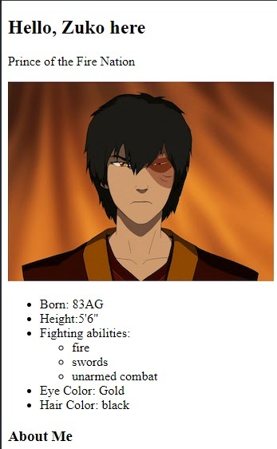

# Adding CSS

An introduction to CSS, adding colour and a little bit of style to your web pages. If you and your group have any questions, or get stuck as you work through this in-class exercise, please ask the instructor for assistance.  Have fun!

1.  If you haven’t already completed the previous exercise, please start [here](https://uviclibraries.github.io/html-css/act-1.html){:target="_blank"}, as this part builds on the topics from the previous section.
2.  So far, you should have at least two HTML pages, one with text and one with text and images. They all should have at least one link to another page. Even with all this lovely text your pages probably look quite plain, like the example below. That’s where CSS (which stands for Cascading Style Sheets) comes into play.

    

3.  CSS is a different language than HTML and has different rules and structure. It is used to alter the presentation of a website and doesn’t hold any new content to the web. This means that the same HTML file can appear dramatically different depending on how CSS is used.
4.  **Linking CSS Stylesheet**
    -   Let’s start off by creating a separate folder, called **“hello-css”**, inside our **“html_workshop”** folder. This can be done in Atom by right clicking html_workshop in the project tab and clicking **“New Folder”**. Make a new file in Atom by right clicking on our new folder in the project tab and select **“New File”**. Save this file as **“styling.css”**.
    -   In order for a CSS file to have any effect on an HTML file, these files need to be linked to each other. This is done in the HTML file by using a link tag. Link tags are placed within the head tags and are self closing tags. Within the link tag we need to have two values: “rel” (which stands for relation and is required for all “link” tags), and “href” (which behaves like the “href” in our “a” tags, and it shows the path to the CSS file). 
        **&lt;link rel = "stylesheet" href="hello-css/styling.css"&gt;**
    -   Save the changes to your HTML file.
    -   Make sure that the link tag is in the head part of the HTML file.
    -   Once our style sheet is linked, refreshing our html file in the browser will fetch the CSS file. To see changes save your CSS file and refresh the browser.
    -   CSS code can be used within an HTML file, but to keep things simple we will only use CSS code in our CSS file.
5.  **CSS Format**
    
    
    
    -   In the code extract above we see a snippet of CSS code. The example is called a **declaration block**. It determines the changes we want to make to a specific HTML element, such as a paragraph 
. Each part of the CSS declaration is explained below. Note that the colours may differ depending on the type.
        -   The **p** in this case, is the **selector**. It states which elements we want to style.
        -   **colour** in our example, is the **property**. It states which component of the element we want to change.
        -   **blue**, is the **value**. This is what we want to appear on the page.
        -   The open and closed curly brackets, these things **{ }**, behave in a similar manner as the open and closed tags do in HMTL. The example shows all the values we want **p** to have.
        -   The semicolon on line 2 signifies the ending of a "declaration".
    -   Each block can hold multiple properties. Each property should be on its own line because it makes the block easy to read. Don’t forget to add the semicolon at the end of each rule. Let’s add the following properties and values:
        `background-colour:grey;`
        `text-decoration:underline;`
    -   Feel free to change the values if you wish.
    -   Your CSS file should now contain something like this. Save it and go back to your browser and refresh your **index.html** page. You should see the changes you’ve made.
    
        
    
    -   Note: not every single colour has been made available in word form. You can look up those that are available here. For colours not available, we can use its hexadecimal code. You’re probably familiar with decimal numbers: 0, 1, 2, 3, 4, 5, 6, 7, 8, and 9. Hexadecimal works the same except it has 16 unique numbers; 0, 1, 2, 3, 4, 5, 6, 7, 8, 9, A, B, C, D, E, and F. The hexadecimal numbers for colours have 6 digits, divided into three sections. 000000. The first 2 numbers represent how much red goes into the color, the middle two represents how much green is in the colour, and the last 2 are how much blue. If you’re interested in playing around with hexadecimal numbers, start by replacing “blue” with “#0000FF” and you’ll get the same result. Then change the hexadecimal number as you see fit. (#000000 is black, no colour, and #FFFFFF is white, all colours.)
6.  There are a lot of different properties that we can change. Each element has a selection of what can be changed, but there are many shared between elements. No one is expected to memorize all of them, but it’s good to know the main ones and the rest you can always look up. Here are a few to start playing with:
    -   font-style: can take on the values "normal", "italic", or "oblique"
    -   font-size: for now use px as the value, eg: 30px
    -   text-align: can take on the values "center", "left", or "right"
7.  Now add more blocks for different types of tags. Here are some suggestions:
    -   body
    -   h1 (you can assign multiple tags to the same block and have a tag in multiple blocks.)
    -   a
    -   ol
    -   ul
    -   li

    

8.  Some properties you can change are as follows:
    -   colour: #012345;
    -   background-colour: #6789AB;
    -   font-size: 10px;
    -   text-align: center; (or left or right)
    -   text-transform: uppercase; (or lowercase or capitalize)
    -   letter-spacing: 10px; (could also be negative eg: -10px)
    -   font-style: italic; (or normal or oblique)
    -   list-style-type: circle; (only works for lists)
        -   could also be square, lower-alpha, upper-roman
9.  CSS files can be used for multiple HTML pages and a single HTML page can have multiple CSS stylesheets.
10.  Try adding your new CSS file to other HTML files.
11.  Below is an example for the Zuko about me page:

     

[NEXT STEP: Using CSS to Change Layout](act-4.html){: .btn .btn-blue }
