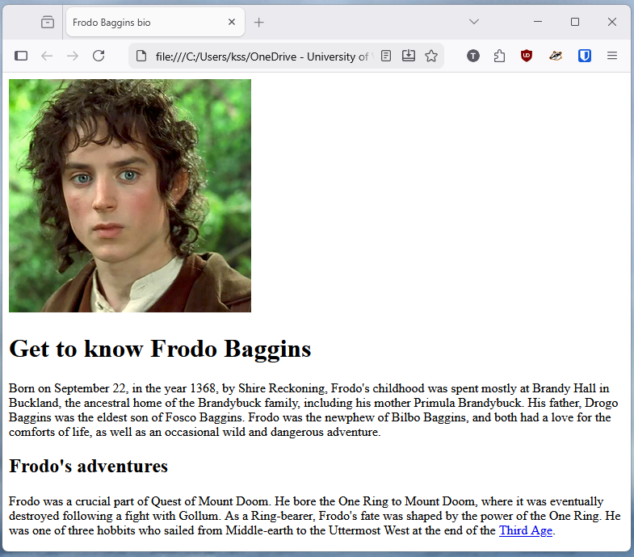
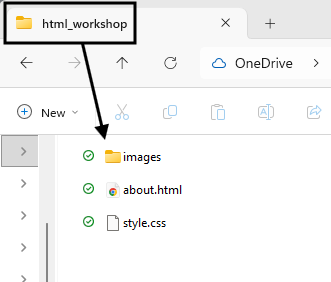
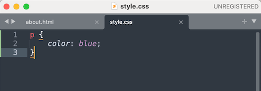

# Introducing CSS

If you haven’t already completed the previous exercises, please start on the [Getting Started With HTML](https://uviclibraries.github.io/html-css/act-1.html) page, as this section of the workshop builds on the topics from previous sections.

This section of the workshop is on [Cascading stylesheets (CSS)](https://www.w3schools.com/Html/html_css.asp). **Think of HTML as the builder and CSS as the artist.** CSS is a different language than HTML and has different rules and structure. 

CSS is used to alter the presentation of a website. Basically, CSS tells browsers the rules for what your various HTML elements, like paragraphs `<p>`, headings `<h1>`, and other content, should look like. CSS also controls things like the size and spacing between objects, like images, and text, and so much more. 

It can take many years of practice to become competent in the nuances of CSS. Getting CSS to work the way you want to can sometimes try your patience, but it is worth it when things work, so stick with it and be prepared to have fun breaking things. 

**For this part of the workshop, you will learn a CSS fundamental: how to link to a "stylesheet,"** and then you will get to play around as you like with some resources provided. 

## On our journey, so far... 

Let's take a moment to look at what your `about.html` page should look like so far. Here's the full code from my `about.html`, just in case you need to compare, or start from scratch if your site is not working as expected: 

```
<!DOCTYPE html>
<html>

<head>
<meta charset="utf-8">
<title>Frodo Baggins bio</title>
</head>

<body>

<h1>Get to know Frodo Baggins</h1>

<p>Born on September 22, in the year 1368, by Shire Reckoning, Frodo's childhood was spent mostly at Brandy Hall in Buckland, the ancestral home of the Brandybuck family, including his mother Primula Brandybuck. His father, Drogo Baggins was the eldest son of Fosco Baggins. Frodo was the newphew of Bilbo Baggins, and both had a love for the comforts of life, as well as an occasional wild and dangerous adventure.</p>

<h2>Frodo's adventures</h2>

<p>Frodo was a crucial part of Quest of Mount Doom. He bore the One Ring to Mount Doom, where it was eventually destroyed following a fight with Gollum. As a Ring-bearer, Frodo's fate was shaped by the power of the One Ring. He was one of three hobbits who sailed from Middle-earth to the Uttermost West at the end of the <a href="https://en.wikipedia.org/wiki/History_of_Arda#Third_Age">Third Age</a>.</p>

</body>

</html>

```

Visually speaking, my web page is pretty basic. Here's what it looks like at this point in Firefox: 



Using CSS will make our growing website look a little more stylish and colourful. When we talk about "styling" our web pages, we mean making changes to the look, layout, colour choices, and other visual elements of web pages. 

## Linking CSS to your HTML content: creating a "stylesheet" 

In the same way that we created a place to keep our images, we need a way to keep track of the changes we make to the style our web page. As the [W3Schools website points out](https://www.w3schools.com/Html/html_css.asp), CSS allows you to do a lot, such as "control the color, font, the size of text, the spacing between elements, how elements are positioned and laid out, what background images or background colors are to be used, different displays for different devices and screen sizes, and much more!"  

There is a way to "embed" CSS "rules" directly between the `<head></head>` tags in your HTML file, and this method is usually fine for simple, one-page websites (and you can try this, below). Usually, though, web developers consider it "best practice" to have an "external," or separate, dedicated "stylesheet" that contains all the CSS rules for your whole site. And, you can see how this would be vital for sites with dozens of pages because you only have to change something in one place in order to change all your web pages' styles at once.

1. Return to Submlime Text and create a new file: name the file as follows: `style.css`. Now, save the file in your `html_workshop` folder. **<mark>Important:</mark>** make sure you save the file at the same "level" as the `about.html` file. Here is what your `html_workshop` folder should look like, now:  

2. In Sublime Text, return to your `about.html` file. In the same way that we created a link to an image file, in our `about.html` page, we are going to create a link between an HTML file and our CSS file, or stylesheet (the `style.css` file we just created).
3. As a rule, links to stylesheets always go within the `<head></head>` tags of an HTML document. So, just under the `<title>` tags, add the following: `<link rel="stylesheet" href="style.css">`. Here is an example of what the stylesheet link looks like in my `about.html` page:

 ```
<head>
<meta charset="utf-8">
<title>Frodo Baggins bio</title>
<link rel="stylesheet" href="style.css">
</head>

```
Notice a few things about the stylesheet link: 
- it is placed just _above_ the closed `</head>` tag
- it is "self-closing," and does require a closing tag
- the ["rel" attribute](https://www.w3schools.com/TAGS/att_a_rel.asp) of the link stands for "relation", and this is required for all stylesheet links
- the ["href" attribute](https://www.w3schools.com/tags/att_a_href.asp) should look familiar, now, as we saw this in the previous section on adding links to am HTML document
  this attribute specifies the file path to the `style.css` file, and since it is on the same level as the `about.html` file, the

- **<mark>Note</mark>** that you may need to hard refresh (clear your cache) in your browser to see your CSS rules take effect in your `about.html` page.

## Get to know some basic CSS terms

- Here is an example of a "CSS declaration block," which contains an ordered collection of CSS properties and values:<br/>



- The declaration block "declares" what it will do to change a specific HTML element, such as a paragraph `<p>`. 
- In CSS-speak, the HTML element you want to change, or "style," is called the "selector". So, let's put this all together:<br/>


- Note that the CSS declaration lives within "**curly brackets**" `{` `}`. Think of these curly brackets like the open and closed tags in HMTL. 
- The example above shows all the "values" that would apply to any and all `h1` tags in your HTML file.
- Note the use and placement of the **semicolon(s)**. Semicolons signify the end of individual declarations. 
- <mark>Important</mark>: always add a semicolon at the end of each declaration. Do not (accidentally) add any spaces before the semicolon or your declaration will be "invalid" and not work: 
  - Invalid: `color:blue ;`
  - Valid: `color:blue;`
- Note that CSS is written with USA spelling, so it's "color" not "colour". 
- A declaration block can hold multiple properties. Each property should be on its own line because it makes the block easy to read. 
- Technically, it does not matter what order we place our declarations. Modern computers and browsers read CSS very quickly. However, if you had a large CSS file, with hundreds of declarations, page-load times can be affected and it will be important to keep your CSS tidy and easy to read.
- For reasons of speed, readability, and more, web developers typically use a variety of CSS best practices, which you will encounter eventually if you carry on in web development.
- Here is an example of a well formed CSS "ruleset" (which contains the selector, declarations, properties, and values):
        
 ```
 h1 {
      text-decoration:underline;
      font-size:25px;
      color: blue;
 }
```
- In the example above, we are telling browsers to do the following: make all our `h1` headings underlined, 25 pixel font size, and blue in colour. 

## Choose your own CSS quest! 

This is the time to play around with CSS in a way that works for you. Maybe you want to change the look of your headings, or add a background colour to your web page, or add some indents. 

**From here forward, you will follow the same process:**
1. pick a CSS tutorial from the selections below
2. make additions/changes to your `style.css` file
3. Save the `style.css` file
4. Open your `about.hmtl` file in a browser and refresh it to see your changes
5. Repeat for as long as your patience lasts, or until this workshop ends...  

Remember that breaking things, especially digital things, is how we learn. 

Good luck, web traveler <span style='font-size:30px;'>&#129497;</span>

## Your CSS quest list

We have curated a sampling of fundamental **tutorials from the W3Schools website**, which is a great resource to learn about, as it is used by beginner and seasoned developers alike. And, we have set some quests from easier to more difficult. 

As ever, if you have any questions, or get stuck, please ask the instructor for assistance. 

In keeping with the theme of this workshop, we have ordered the quests in **three levels of difficulty**. 

### Making it to The Prancing Pony
- [change text colour](https://www.w3schools.com/css/css_text.asp) in some way
- [add some text decoration](https://www.w3schools.com/css/css_text_decoration.asp)
- [align your text](https://www.w3schools.com/css/css_text_align.asp) in some way
- [change some text spacing](https://www.w3schools.com/css/css_text_spacing.asp)
- [add a mystical shadow to some text](https://www.w3schools.com/css/css_text_shadow.asp)
- [add a background image](https://www.w3schools.com/css/css_background_image.asp)

Or [choose another beginner tutorial](https://www.w3schools.com/Css/) to try. 

### Passing through the Mines of Moria
For these quests, it will help to know about [HTML "div" tags](https://www.w3schools.com/Tags/tag_div.asp), and [CSS selectors](https://www.w3schools.com/css/css_selectors.asp) and how they work together... 
- [add a background colour](https://www.w3schools.com/css/css_background.asp) to your whole web page
- [play with the margins of a paragraph](https://www.w3schools.com/css/css_margin.asp)
- [tackle CSS position](https://www.w3schools.com/Css/css_position.asp)
- [create a div and apply some padding](https://www.w3schools.com/css/css_padding.asp)
- [create a div and center it on your page](https://www.w3schools.com/css/css_padding.asp)

As above, [choose another beginner tutorial](https://www.w3schools.com/Css/) to try. 

### Defending Helms Deep
For these quests, it will vital that you are comfortable with creating [HTML "div" tags](https://www.w3schools.com/Tags/tag_div.asp), and using [CSS selectors](https://www.w3schools.com/css/css_selectors.asp)... 

- [play around with flex boxes](https://www.w3schools.com/css/css3_flexbox.asp)
- [create a div and make its corners round](https://www.w3schools.com/css/css3_borders.asp)
- [make a groovy gradient as a page background](https://www.w3schools.com/css/css3_gradients.asp)
- [create a clickable button](https://www.w3schools.com/Css/css3_buttons.asp)
- [try to get an animation working](https://www.w3schools.com/css/css3_animations.asp)

This workshop was designed to bring you into the world of HTML and CSS, so thanks for being part of the journey <span style='font-size:20px;'>&#128568;</span>.

If you want to take things to the next level, we have some resources in the next section. 

[NEXT STEP: Making your own website](https://uviclibraries.github.io/html-css/act-5.html){: .btn .btn-blue }
