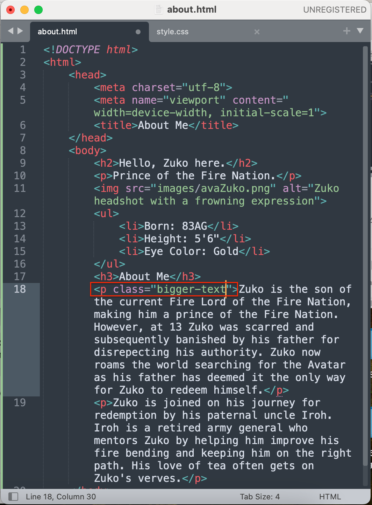
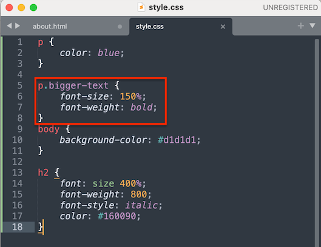
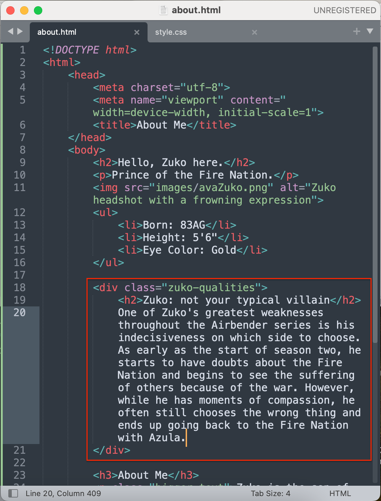
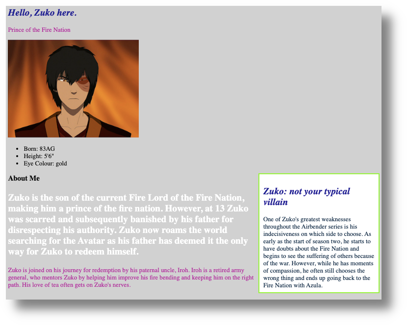
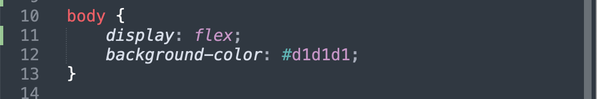
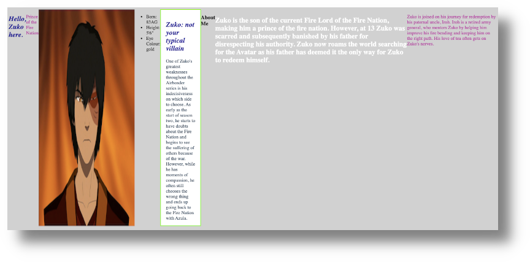
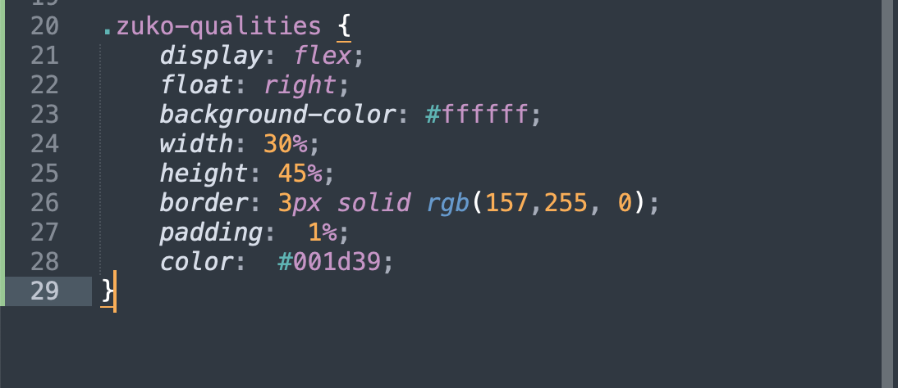
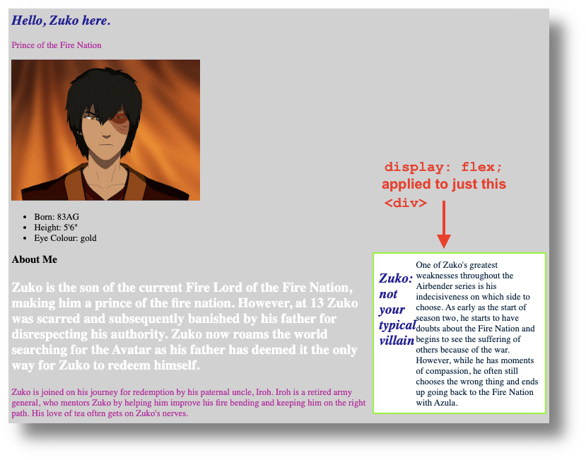

# Using CSS to Change Layout

If you haven’t already completed the previous exercises, please start on the [Getting Started With HTML](https://uviclibraries.github.io/html-css/act-1.html) page, as this part builds on the topics from previous sections.

This section teaches you some CSS basics, so that you can alter the look and function of a basic HTML page. 

If you have any questions, or get stuck, please ask the instructor for assistance. Have fun and be patient with yourself because CSS, especially layout, can be tricky! 

So far, we have learned to tinker with the following: 
- HTML pages
- Headings, text, and lists
- Images
- Links (external, internal, and anchors)
- CSS stylesheets and how to link them to an HTML page
- Some basic CSS styling

Here is what my `about.html` page looks like in Chrome, so far: 
    


Notice that the content of my `about.html` page is stacked like a list, from top to bottom. This stacking is the default layout of HTML files, but CSS can change this layout in a number of ways. 

But, before we can make any layout changes, let's take a look at CSS "classes". 

## CSS classes

- Earlier, we had looked at CSS "selectors," such as the `h1` in the example, below:


- Classes are another type of selector you can use to define specific rules for specific HTML tags. 
- This workshop is all about learning by doing, so we'll dive into an example to see how CSS classes work. 
- In my `about.html` page, for example, I have two paragraphs, that is, text content between two sets of open and closed `p` tags. 
- Let's say that I want the text to look bigger in the first paragraph, but not in the second. If I use a `p` tag as the selector, then whatever CSS styles I apply would change the content to look the same in _both_ paragraphs. We can use custom class to make these paragraphs look different from each other.   
- To make my paragraph style changes, I will create a CSS "class" in my HTML file and create some CSS rules for it in my CSS file. 

### Adding a class to the HTML file

- You can follow along with what I do, copy/pasting as you go, or create your own CSS class block, based on what I do in the following steps. 
- I have added this class to the first paragraph in my `about.html` page: `<p class="bigger-text">`. 
- <mark>Important</mark>: **do not put spaces in your class names**:
  - Incorrect: `<p class="bigger text">`
  - Correct: `<p class="bigger-text">`
- Here is what my `<p class="bigger-text">` class looks like, in context, in my `about.html` page: 

```
<p class="bigger-text">Zuko is the son of the current Fire Lord of the Fire Nation, 
making him a prince of the fire nation. However, at 13 Zuko was >scarred and subsequently 
banished by his father for disrespecting his authority. Zuko now roams the world searching for
the Avatar as his father has >deemed it the only way for Zuko to redeem himself.</p> 

<p>Zuko is joined on his journey for redemption by his paternal uncle, Iroh. Iroh is a 
retired  army general, who mentors Zuko by helping him improve his fire bending and keeping 
him on the right path. His love of tea often gets on Zuko's nerves.</p>

```

Here is what my `<p class="bigger-text">` class looks like in my `about.html` page, in Sublime: 



- I could create a separate class for the second paragraph, but I am happy with its font size already, so I am only creating a class for the content I want to change. 

### Adding a class to the CSS file

- Now that I have added my `<p class="bigger-text">` class to my `about.html` file, it's time to write a corresponding CSS class block in my CSS file. 
- My CSS class will get its own code block and properties and values.
- <mark>Important</mark>: **in CSS, all class blocks are preceded by a period**.
- Here is what the class looks like in my CSS file: `.bigger-text`. 
- Remember, though, that we want to apply our changes to a paragraph `<p>`, but with the _addition_ of the `.bigger-text` class. So, what we end up with is a combination of two selectors: `p.bigger-text`.
- Here is what my class block looks like in context, and with some properties (`font-size` and `font-weight`) and values (`150%` and `bold`):      

```
p.bigger-text {
	font-size:150%;
	font-weight: bold;
	}
```

Here is what my class block looks like in my `style.css` file, in Sublime: 



- Finally, here is what the `about.html` page now looks like in my browser: 


- You may have noticed that all the text in both paragraphs is still pink in colour. This is because the `p` selector (in the class block above my `p.class` class) still determines the colour value for _all_ `p` selectors. Put another way, the `p` has **precedence** over `p.class`. Another way to think about this is that my `p.class` **inherits** the values of the `p` selector because the `p` selector is higher up in the CSS hierarchy. 
  - Note that CSS hierarchy, or "style order," is very complicated, but the curious can consult [this handy chart](https://vecta.io/blog/definitive-guide-to-css-styling-order/definitive-guide-to-css-styling-order.611928c06a.svg) to see how it all fits together. 
- However, I can override this precedence order by adding a declaration (a tech-language definition for the combination of a CSS property and its value) within my `p.class`. In the following example I have declared a colour for the text by adding `color: #ffffff;`: 

```
p.bigger-text {
	font-size:150%;
	font-weight: bold;
        color: #ffffff;
	}
```

- Here is what this font colour change looks like in my browser: 


<!--  -->
- As far my browser is concerned, `p` and `p.bigger-text` are different classes, with different CSS rules, even though they both have `p` selectors. 

We have just practiced one way to make a class, by combining it with an existing selector. We can also create an entirely unique class that has no relationship to common selectors, such paragraphs, headings, and lists. 

Next, I will create a division, or "div", of content in our `about.html` file and then use a CSS class to assign it some declarations. 

## Divisions, or `<div>` tags

- As with the above section, feel free to copy/paste what I have done or create your own content. 
- A `div` tag, in HTML, is comprised of an open and closed tag: `<div></div>`. 
- Divs define sections within our code. Think of them as content organizers.
- Applying a class to `div` tag changes everything within its open and closed `<div></div>` tags.
- In my `about.html' file, I have added this `div` class to some text: `<div class="zuko-qualities"></div>` 
<!--  -->
- Here is the entire `div`, including its content: 

```
<div class="zuko-qualities">
	<h2>Zuko: not your typical villain</h2>
	One of Zuko's greatest weaknesses throughout the Airbender series is his indecisiveness on which side to choose. 
	As early as the start of season two, he starts to have doubts about the Fire Nation and begins to see the suffering 
	of others because of the war. However, while he has moments of compassion, he often still chooses the wrong thing 
	and ends up going back to the Fire Nation with Azula.
</div>
```

- Here is what my my new `div` looks like in my `about.html` file, in Sublime: 



- Now it's time to add some CSS rules to my `<div class="zuko-qualities">` in my `style.css` file. 
- Note that I have added **CSS comments**, which look like this: `/* your comment content goes here */`. 
- Comments are not displayed in browsers. Think of them as explanatory notes for what your CSS rules are doing. 
  - For the curious, you can read more about comments, and when to use them, on the [W3Schools CSS Comments page (↪)](https://www.w3schools.com/css/css_comments.asp). 
- I will add some font styles and play with the position of my new `div`, just to see what it looks like. 
- Feel free to copy/paste the following CSS code block into your `style.css` file and play around with its various values to see what happens: 

```
.zuko-qualities {
    float: right; /* "floats <div> "container" to the right of the page */
    background-color: #ffffff; /* changes <div> background colour */
    width: 30%; /* makes the <div> 30% of page width, no matter window size */ 
    height: 45%; /* makes the <div> 45% of page height, no matter window size */
    border: 3px solid rgb(157, 255, 0); /* adds blue border line around <div> */
    padding: 1%; /* moves the content within the <div> away from the edge on all sides */ 
    color:#001d39; /* changes <div> text colour */
  } 
  ```

- Make sure to take note of the dot (.) before zuko-qualities.

- Here is what my `about.html` page now looks like in my browser: 



- OK: still gloriously '90s, but now the fun begins again because you can play around with the various values, saving and refreshing your files as you go. 
- For example, observe what happens when we change this: 

`padding: 1%;`

... to this: 

`padding: 20%;`

- If you have time, change other values in our new `<div>`.
- Now you can see how versatile even one `<div>` can be! 
- We have changed the layout of our `<div>` in a basic way, but the world of CSS layout can be complex, depending on what you are trying to do. If you plan to learn more CSS, you will eventually have to have a solid grasp of CSS layout, which you can read more about on the [W3Schools CSS Layout tutorial page (↪)](https://www.w3schools.com/css/css_positioning.asp). 
- One approach to layout is to think of your content—such as paragraphs, images, and `div` sections—as tiles or boxes that can be moved around your web page in various ways.
- Next, we will play with another way of arranging layout, using flexible boxes, or "flexboxes". 

## CSS layout with "flexible boxes," or "flexboxes"

- A flexbox is a CSS layout model used to organize a webpage's content. 
- In the image below, imagine that the coloured squares within the rectangle are separate content containers within a larger container:


- Flexboxes work by separating each element in your HTML page—such as paragraphs, images, `div` sections, or any content—into their own containers, or boxes. 
- The advantage of flexboxes is that they can be be told how to behave and organize themselves, even when viewed with different screen sizes, from desktop computer screens to smartphones.
- We are going to turn our whole `about.html` page into a "flex container," making the elements within it (our divs, paragraph, and images) separate containers, or boxes. 
- Within your `body` selector, add the following `display: flex;`
- Here is my example: 
        
```
	body {
            display: flex;
        }
```
- Here is what `display: flex;` looks like in my `style.css` file, in Sublime:



- Here is what it looks like in my browser, after I have saved my CSS file and refreshed my browser: 



- Wow! Everything looks horizontally arranged in a row, and quite strange. This is to be expected because **the default arrangement for `flex` is to display objects as a row**:


- I don’t want my `about.html` page to look like this either, so I will move the `display: flex;` declaration to my `<div class="zuko-qualities">` and see what happens. 
- Here is what the whole `zuko-qualities` class block now looks like: 

```
.zuko-qualities {
    display: flex;
    float: right;
    background-color: #ffffff;
    width: 30%;
    height: 45%;
    border: 3px solid rgb(157, 255, 0);
    padding: 1%;
    color:#001d39;
  } 
```

Here is what the `zuko-qualities` class block looks like in my `style.css` file, in Sublime: 



- Here is what my `about.html` page now looks like in my browser: 



- Notice that, now, only the content within the `<div class="zuko-qualities">` is horizontal. The text does not look that great, but the goal with this experiment is to learn what flexboxes can do. 
- If you had two images, for example, and wanted them to sit side-by-side, you could create a `div` in your `about.html` file, and then place image links within the `div`. Then, in your `style.css` file, add `display:flex;` to the CSS declarations for your new `div`. By default, the images would sit horizontally in a row. 
- Flexboxes can be tricky to understand until you start playing with them. As your web pages become more complicated, generally, the CSS rules for your page will as well. 
- If you have the time, you can practice playing with flex boxes by working through the [W3Schools CSS Flexbox tutorial (↪)](https://www.w3schools.com/css/css3_flexbox.asp). 

<!-- [Note to DSC: I commented out this whole section because we already point students to the W3Schools site, which does a good job of working through the reasons why and in what circumstances you would use certain flex box values] 
-There are many different ways to manipulate flex boxes with built-in properties. Try a few of the following values to see what they do: 
- `flex-direction: row;`: “row” aligns flex items horizontally, from left to right. 
- `flex-direction: row-reverse;`: “row-reverse” aligns flex items horizontally, from right to left, but be advised that this value may conflict with page-indent and how users utilizing assistive technology view your page.
- `flex-direction: column;`: “column” aligns flex items vertically, from top to bottom.
- `flex-direction: column-reverse;`: “column-reverse” aligns flex items vertically, from bottom to top, but be advised that this value may conflict with page-indent and how users utilizing assistive technology view your page.
- `flex-wrap: (wrap / nowrap);`: should your flexbox items extend past the width of your browser page and you do not want users to side scroll, the “wrap” value will stack the following content below. In the example below, without “wrap” the purple box would sit outside the browser window, as represented by the  orange outline. With “wrap,” the purple box aligns below the green and orange boxes.


	
- [justify-content](https://css-tricks.com/almanac/properties/j/justify-content/#:~:text=The%20justify%2Dcontent%20property%20is,have%20reached%20their%20maximum%20size.): (flex-start(default) / flex-end / center / space-between / space-around);
  - This property changes how the flex boxes are spaced between other flexboxes. This can be a fun one to play around with as it can dramatically change the layout of a page.
- [align-items](https://css-tricks.com/almanac/properties/a/align-items/): (flex-start / flex-end / center / stretch);
  - This property dictates how flex boxes are aligned vertically. Flex-start makes them all start at the top, flex-end makes them all end at the bottom, center makes their center sit in the center, stretch forces all items to cover the entirety of the flex box.
For having items in the center of your flex box, apply both of the following:
- `justify-content: center;`
- `align-items: center;`-->

**🎊 Congratulations! You have now completed our Introduction to Coding With HTML & CSS workshop!** See the Next Steps page for additional resources and more....  

[NEXT STEP: Next Steps]
