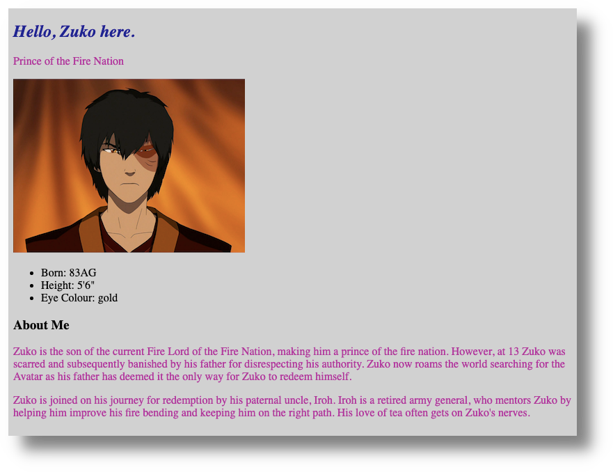
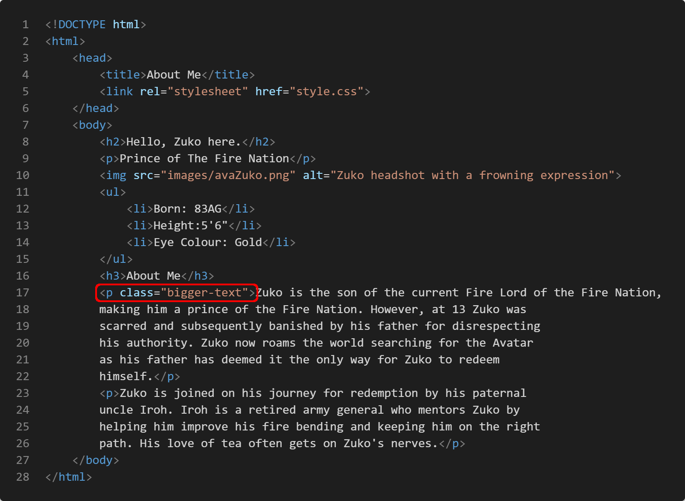
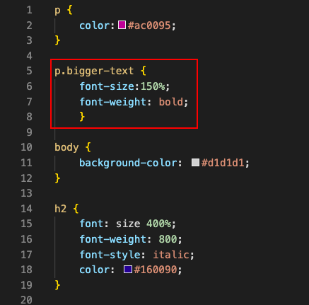
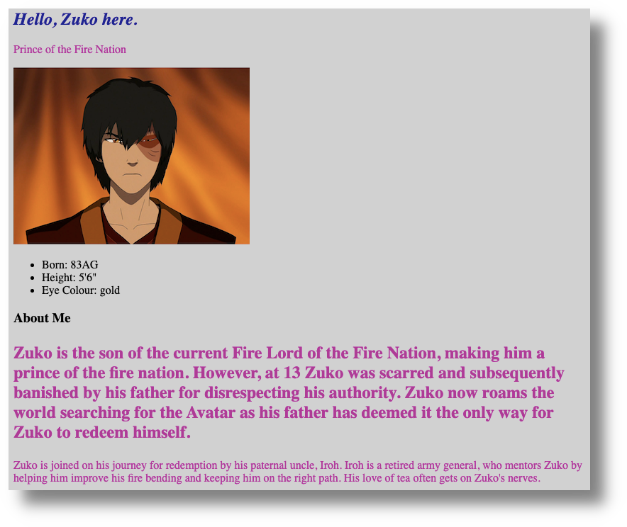
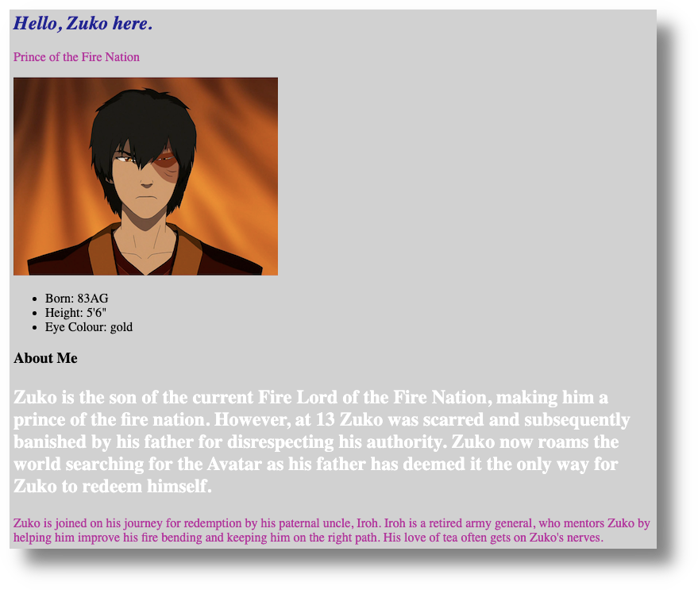
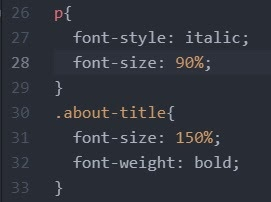
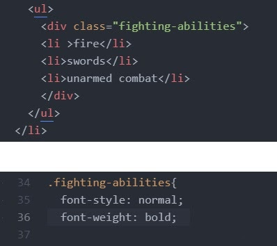
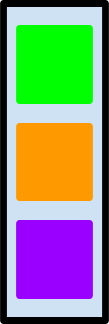
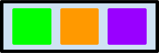
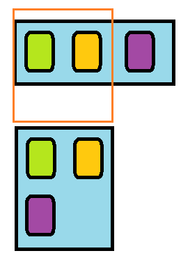

# Using CSS to Change Layout

This section teaches you some CSS basics, so that you can alter the look and function of a basic HTML page. If you and your group have any questions, or get stuck as you work through this in-class exercise, please ask the instructor for assistance.  Have fun!

If you haven’t already completed the previous exercise, please start [here](https://uviclibraries.github.io/html-css/act-3.html).

So far, we have learned to tinker with the following: 
- HTML pages
- Headings, text, and lists
- Images
- Links (external, internal, and anchors)
- CSS stylesheets and how to link them to an HTML page
- Some basic CSS styling

Here's what my `about.html` page looks like in Chrome, so far: 
    


Notice that the content of my `about.html` page is stacked like a list, from top to bottom. This stacking is the default layout of HTML files, but CSS can change this layout in a number of ways. 

But, before we can make any layout changes, we need to understand CSS "classes". 

## CSS classes
- Earlier, we had looked at CSS "selectors," such as the `h1` in the example, below:


- Classes are another type of selector you can use to define specific rules for specific HTML tags. 
- Since it's easier for most of us to learn by doing, we're dive into an example to learn how CSS classes work. 
- In my `about.html` page, for example, I have two paragraphs, that is, text content between two sets of open and closed `p` tags. Let's say that I want the text to look bigger in the first paragraph, but not in the second. If I use a `p` tag as the selector, then whatever style I apply would change the content to look the same in _both_ paragraphs. We can use custom class to make these paragraphs look different from each other.   
- To make my paragraph changes, I will create a CSS "class" in my HTML file and create some CSS rules for it in my CSS file. 

### Adding a class to the HTML file

- You can follow along with what I do, copy/pasting what I do as you go, or create your own class, based on what I do in the following steps. 
- I have added this class to the first paragraph in my `about.html` page: `<p class="bigger-text">`. 
- <mark>Important</mark>: **do not put spaces in your class names**:
  - Incorrect: `<p class="bigger text">`
  - Correct: `<p class="bigger-text">`
- Here is what my `<p class="bigger-text">` class looks like, in context, in my `about.html` page: 

```
<p class="bigger-text">Zuko is the son of the current Fire Lord of the Fire Nation, 
making him a prince of the fire nation. However, at 13 Zuko was >scarred and subsequently 
banished by his father for disrespecting his authority. Zuko now roams the world searching for
the Avatar as his father has >deemed it the only way for Zuko to redeem himself.</p> 

<p>Zuko is joined on his journey for redemption by his paternal uncle, Iroh. Iroh is a 
retired  army general, who mentors Zuko by helping him improve his fire bending and keeping 
him on the right path. His love of tea often gets on Zuko's nerves.</p>

```

Here is what my `<p class="bigger-text">` class looks like in my `about.html` page, in VCS: 



- I could create a separate class for the second paragraph, but I am happy with its font size already, so I am only creating a class for the content I want to change. 

### Adding a class to the CSS file

- Now that I have added my `<p class="bigger-text">` class to my `about.html` file, it's time to write a corresponding CSS class block in my CSS file. 
- My class will get its own code block and properties and values.
- <mark>Important</mark>: **in CSS, all class blocks are preceded by a period**.
- Here is what the class looks like in my CSS file: `.bigger-text`. 
- Remember, though, that we want to apply our changes to a paragraph `<p>`, but with the _addition_ of the `.bigger-text` class. So, what we end up with is a combination of two selectors: `p.bigger-text`.
- Here is what my class block looks like in context, and with some properties (`font-size` and `font-weight`) and values (`150%` and `bold`):      

```
p.bigger-text {
	font-size:150%;
	font-weight: bold;
	}
```

Here is what my class block looks like in my `style.css` file, in VCS: 



- Finally, here is what the `about.html` page now looks like in my browser: 



- You may have noticed that all the text in both paragraphs is still pink in colour. This is becasue the `p` selector (in the class block above my `p.class` class) still determines the colour value for _all_ `p` selectors. Put another way, the `p` has **precedence** over `p.class`. Another way to think about this is that my `p.class` **inherits** the values of the `p` selector because the `p` selector is higher up in the CSS hierarchy. 
  - Note that CSS hierarchy, or "style order," is very complicated, but the curious can consult [this handy chart](https://vecta.io/blog/definitive-guide-to-css-styling-order/definitive-guide-to-css-styling-order.611928c06a.svg) to see how it all fits together. 
- However, I can override this precedence order by adding a declaration (a tech-language definition for the combination of a CSS property and its value) within my `p.class`. I have declared a colour for the text (`color: #ffffff;`): 

```
p.bigger-text {
	font-size:150%;
	font-weight: bold;
        color: #ffffff;
	}
```

- Here is what this font colour change looks like in my browser: 



<!--  -->
- As far as a browser is concerned, `p` and `p.bigger-text` are different classes, with different CSS rules, even though they both have `p` selectors. 

We have just practiced one way to make a class, by combining it with an existing selecto. We can also create an entirely unique class that has no releationship to common selectors, such paragraphs, headings, and lists. 

Next, I will create a division, or "div", of content in our `about.html` file and then use a CSS class to assign it some declarations. 

## Divisions, or `<div>` tags

- As with the above section, feel free to copy/paste what I have done or create your own content. 
- A `div` tag, in HTML, is comprised of an open and closed tag: `<div></div>`. 
- Divs define sections within our code. Alone, a `div` tag doesn’t do much. However, with CSS, it helps to organize our content into groups.
- Applying a class to `div` tag changes everything between the open and closed `<div></div>` tags.
- In my `about.html' file, I have added a `div` class to a nested list (list within a list). This way, I can change the items in my nested list without affecting the main list, or even other lists I may have.
	

	
- Division tags can also take advantage of precedence. A division tag enclosed within another division tag has higher precedence than the outside division tag.

## CSS layout with "flexible boxes," or "flexboxes"

- Despite all the changes we’ve made so far, nothing on our `about.html` page has moved around: this is where flexible boxes or "flexboxes" comes in handy.
- A flexbox is CSS layout model used to organize a webpage's content.



- Flexbox works by separating each item into its own box. These flexboxes can be told how to behave and organize themselves, even when viewed with different screen sizes, from desktop computer screens to smartphones.
- Let's start by adding a "flex container" to our `<body>` tag in CSS. 
- Add the following in your CSS file: 
        
```
	body {
            display: flex;
        }
```
- Refresh your HTML page and the boxes should appear horizontally.



- I don’t want my `about.html` page to look like this either, and so I can use `<div>` tags to organize things further. 
- First get rid of the `display:flex;` we just added in our body tag.
- I want my list to be horizontal relative to the image of Zuko. 
- I’m going to add my opening <div> above the image tag and the closing </div> below the closing unordered list tag:<br>
`<div class=“bio”>`
  - <mark>Note</mark>: in VCS you can highlight everything between the opening and closing division tags and click the tab key. This indents all the highlighted items. Holding the shift key, then clicking the tab key does the opposite, and moves the text closer to the margin.
- Next, go to your CSS file and create a block for the `bio` class and add the `display: flex;` property, as in the following example:
        
```
	.bio {
            display: flex;
        }
```

- Your list should now be to the right of the image of Zuko.
- If you’d like to have the list on the left, there are a few ways to do this: 
  - (1) you could move the list in your HTML code to be above the `` tag, or
  - (2) use the `flex-direction` property in CSS. Flex direction changes the order the items are displayed in. Check out how it works by adding the following to the bio block in your CSS file:

`<flex-direction: row-reverse;>`

### More with flexboxes

-There are many different ways to manipulate flex boxes with built-in properties. Try a few of the following values to see what they do: 
- `flex-direction: row;`: “row” aligns flex items horizontally, from left to right. 
- `flex-direction: row-reverse;`: “row-reverse” aligns flex items horizontally, from right to left, but be advised that this value may conflict with page-indent and how users utilizing assistive technology view your page.
- `flex-direction: column;`: “column” aligns flex items vertically, from top to bottom.
- `flex-direction: column-reverse;`: “column-reverse” aligns flex items vertically, from bottom to top, but be advised that this value may conflict with page-indent and how users utilizing assistive technology view your page.
- `flex-wrap: (wrap / nowrap);`: should your flexbox items extend past the width of your browser page and you do not want users to side scroll, the “wrap” value will stack the following content below. In the example below, without “wrap” the purple box would sit outside the browser window, as represented by the  orange outline. With “wrap,” the purple box aligns below the green and orange boxes.


	
- [justify-content](https://css-tricks.com/almanac/properties/j/justify-content/#:~:text=The%20justify%2Dcontent%20property%20is,have%20reached%20their%20maximum%20size.): (flex-start(default) / flex-end / center / space-between / space-around);
  - This property changes how the flex boxes are spaced between other flexboxes. This can be a fun one to play around with as it can dramatically change the layout of a page.
- [align-items](https://css-tricks.com/almanac/properties/a/align-items/): (flex-start / flex-end / center / stretch);
  - This property dictates how flex boxes are aligned vertically. Flex-start makes them all start at the top, flex-end makes them all end at the bottom, center makes their center sit in the center, stretch forces all items to cover the entirety of the flex box.
For having items in the center of your flex box, apply both of the following:
- `justify-content: center;`
- `align-items: center;`

Flexboxes can get complicated when flexboxes are placed within other flexboxes, or [nested (↪)](https://developer.mozilla.org/en-US/docs/Learn/CSS/CSS_layout/Flexbox#nested_flex_boxes), so be aware that we have only dabbled with what flexboxes can do. You can read more about flexboxes on the [W3Shools Flexbox page](https://www.w3schools.com/css/css3_flexbox.asp). 

[NEXT STEP: Next Steps]
