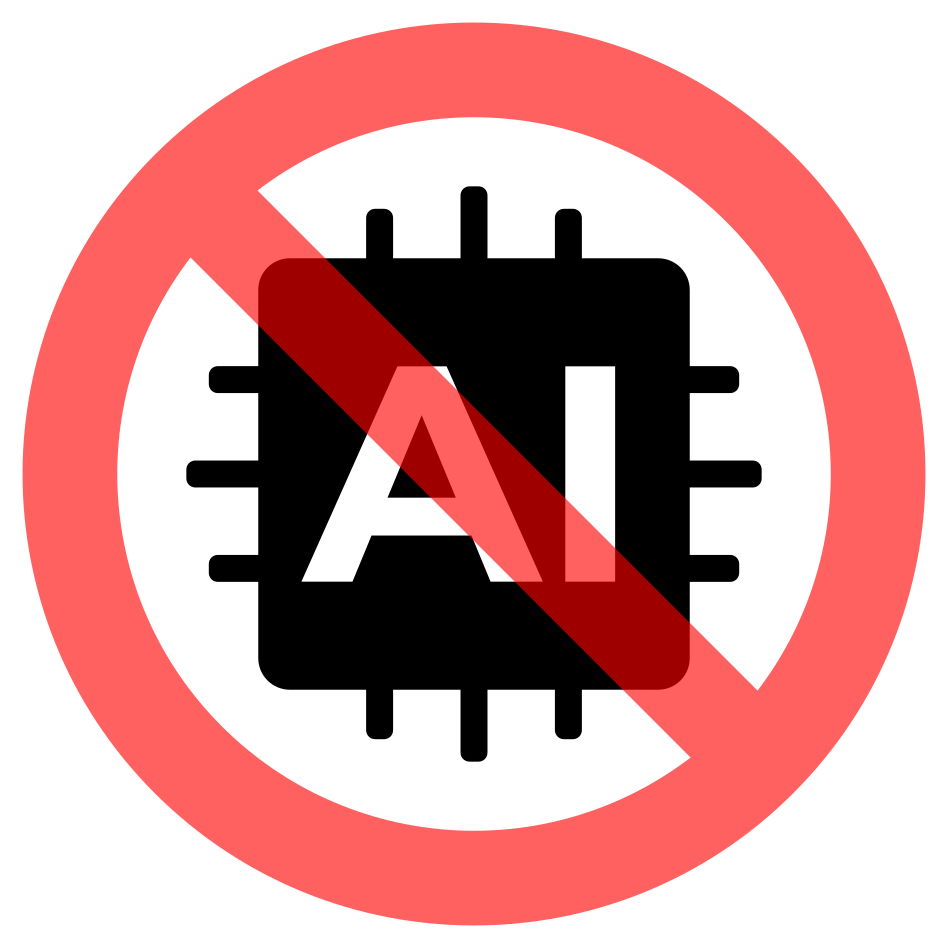

 

# Build a basic AI-free website from scratch: an introduction to HTML and CSS

- Pre-workshop activities: 10 min 
- Introductory presentation: 10 min
- Hands-on activities: 60 min

## Why learn HTML & CSS? 

Website builders like WordPress, Squarespace, and Wix are online services that use a GUI (graphical user interface) to produce websites. And, with the rise of Ai-assisted "[vibe coding](https://github.com/resources/articles/what-is-vibe-coding)," many build websites with little to no understanding of the fundamentals of how they are made or the many rules involved in making them. 

Website services ultimately produce HTML (Hypertext Markup Language) and CSS (Cascading Style Sheets) in order to make working websites. In this workshop, you will gain foundational knowledge in the "languages" and rules of HTML and CSS and how they work together to make the websites we visit every day. 

This workshop will teach you how to take empty text files and turn them into functional web pages, all without needing Ai's help, which is a little journey that can empower you to reclaim some creative and digital autonomy.

## Learning objectives

By the end of this workshop you will be able to do the following:

1. Use a text editor
2. Create and edit an HTML file (webpage)
3. Create and edit a CSS file
4. Add images to your webpage
5. Create links to your own webpages and other Internet webpages
6. Change the layout and look of your webpage
7. View your creations on an Internet browser
8. Learn more about how to create your own public website

Image credit: W3C under the [Creative Commons Attribution 3.0 Unported](https://creativecommons.org/licenses/by/3.0/deed.en) obtained from the [Wikimedia.org](https://commons.wikimedia.org/w/index.php?curid=12736763)

Link: [Introduction to Coding with HTML & CSS slideshow](https://docs.google.com/presentation/d/12ZbaJSflaSLN55PVMGak4isqxv2ISsTlgfkVEzPpBho/edit?usp=sharing)

[NEXT STEP: Pre-Workshop Activities](https://uviclibraries.github.io/html-css/pre-workshop.html){: .btn .btn-blue }
