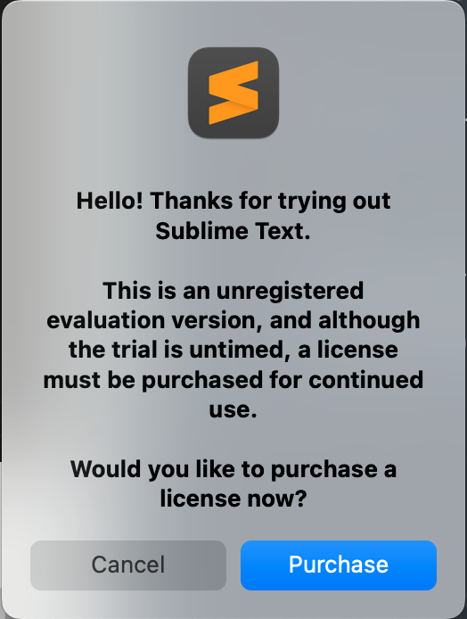

## Pre-Workshop Videos & Activities
This workshop is primarily hands-on practice with HTML and CSS in order to learn key concepts. To participate fully please do the following **before the workshop**:

-   [Why Learn HTML](https://www.youtube.com/watch?v=8N-k0DRRuRY){:target="_blank"} (1 min) 
    <iframe width="560" height="315" src="https://www.youtube.com/embed/8N-k0DRRuRY" title="YouTube video player" frameborder="0" allow="accelerometer; autoplay; clipboard-write; encrypted-media; gyroscope; picture-in-picture" allowfullscreen></iframe>
-   [HTML, CSS, and JavaScript Overview](https://www.youtube.com/watch?v=gT0Lh1eYk78){:target="_blank"} (4 min) 
    <iframe width="560" height="315" src="https://www.youtube.com/embed/gT0Lh1eYk78" title="YouTube video player" frameborder="0" allow="accelerometer; autoplay; clipboard-write; encrypted-media; gyroscope; picture-in-picture" allowfullscreen></iframe>
-   It is recommended that you do not use Internet Explorer as it has been replaced by Microsoft Edge
-   [Install Sublime Text](https://www.sublimetext.com/){:target="_blank"}

A popup will occasionally appear with a suggestion to upgrade to a paid version of Sublime. You can close this popup with no repercussions.

[NEXT STEP: Introduction to Hands-On Activities](activities-intro.html){: .btn .btn-blue }
