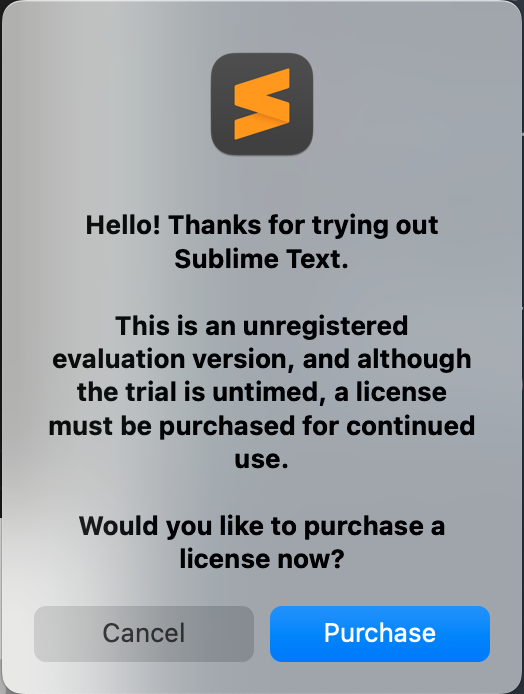

## Pre-workshop videos & activities
This workshop is primarily hands-on practice with HTML and CSS, with an emphasis on key concepts. To participate fully, please do the following **before the workshop**:

-   watch [Why Should I Learn HTML Anyway?](https://www.youtube.com/watch?v=8N-k0DRRuRY) (1 min) 
    <iframe width="560" height="315" src="https://www.youtube.com/embed/8N-k0DRRuRY" title="YouTube video player" frameborder="0" allow="accelerometer; autoplay; clipboard-write; encrypted-media; gyroscope; picture-in-picture" allowfullscreen></iframe>
-   watch [HTML, CSS, JavaScript Explained](https://www.youtube.com/watch?v=gT0Lh1eYk78) (4 min) 
    <iframe width="560" height="315" src="https://www.youtube.com/embed/gT0Lh1eYk78" title="YouTube video player" frameborder="0" allow="accelerometer; autoplay; clipboard-write; encrypted-media; gyroscope; picture-in-picture" allowfullscreen></iframe>
-  Install [Sublime Text](https://www.sublimetext.com/download) text editor

> **NOTE:** Sublime Text is a [text editor](https://en.wikipedia.org/wiki/Text_editor). After this workshop, you may choose a different text editor, or use the one installed already on your computer (Mac has [TextEdit](https://support.apple.com/en-ca/guide/textedit/txtee6663a0e/1.20/mac/26), and Windows has [Notepad](https://www.wikihow.com/Use-Notepad)). But, to make sure we are all able to follow the same workshop steps, we will all use the same text editor. Sublime Text is free, and it has some handy features we will use later. 
>
> While you are using it, Sublime Text will occasionally show you an upgrade popup. You can click the Cancel button with no repercussions. 

[NEXT STEP: Introduction to Hands-On Activities](activities-intro.html){: .btn .btn-blue }
